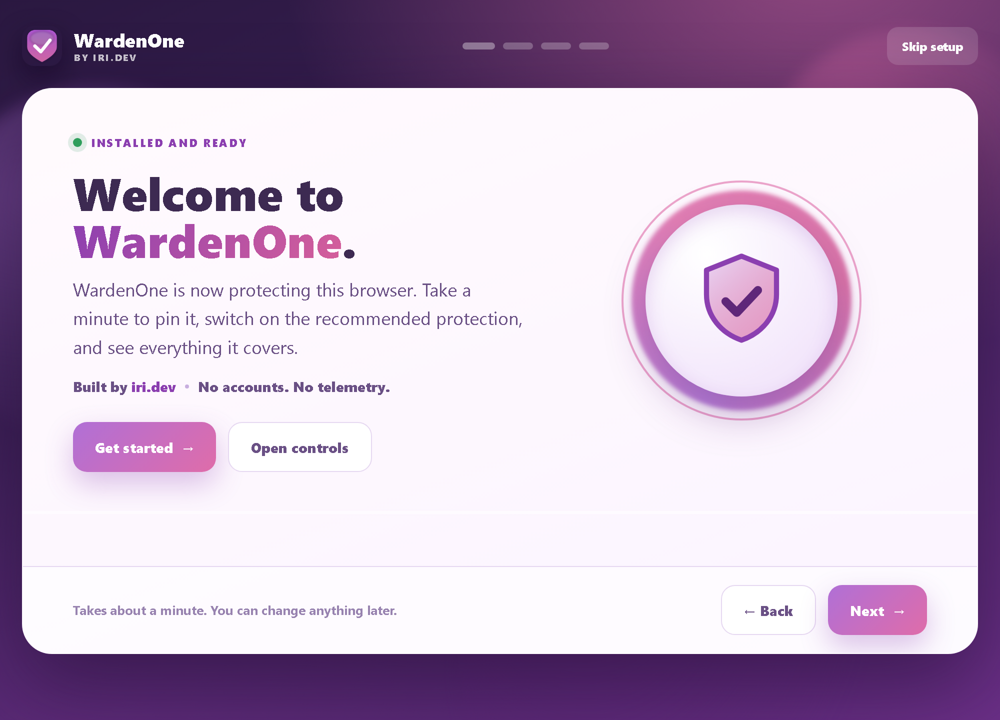
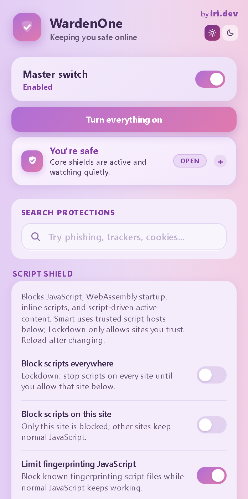
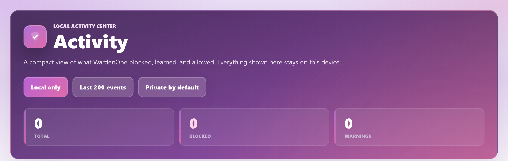
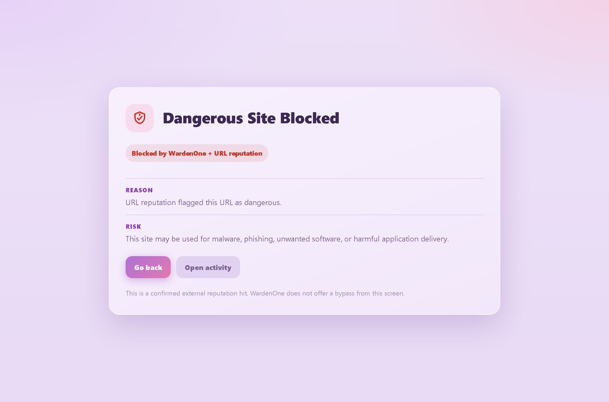
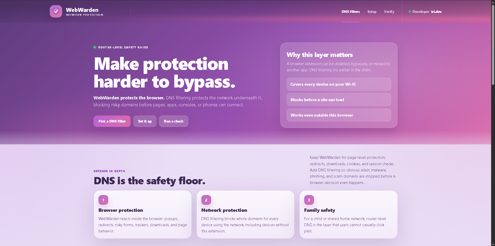
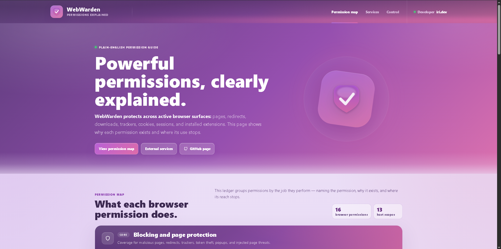

# WebWarden

### The all-in-one privacy, security &amp; anti-scam extension for Chromium browsers

  

> **One master switch. 80+ protections. No account, no telemetry — everything runs on your device.**

WebWarden folds a whole stack of security tools into a single extension: ad and
tracker blocking, anti-fingerprinting, phishing and scam defence, credential- and
payment-theft protection, download scanning, IP-leak protection, media / device
permission control, and memory management. Every feature is individually toggleable,
and none of it phones home.

---

## Why WebWarden

Staying safe online usually means bolting together half a dozen extensions — uBlock
Origin, a fingerprint blocker, a popup blocker, a download scanner, a password-field
guard, a tab suspender — and hoping they cooperate. WebWarden does all of that, plus
the phishing, scam, and credential-theft protection most blockers leave out — behind
one switch, with fine-grained control over every piece.

  

<em>The control panel — every protection in one place, with a live per-site security scan.</em>

## Features

### Ad &amp; content blocking — AdShield
- **General** — EasyList / uBlock-style filtering (network + cosmetic + anti-adblock scriptlets).
- **YouTube** — removes pre-roll and mid-roll video ads by pruning the ad schedule out of the player data; no black screen, no skip button.
- **Twitch** — removes stitched-in pre-roll and mid-roll stream ads, with a silent-segment fallback so playback never breaks.
- **Sponsored results &amp; AI answers** — strips sponsored Google / Brave results and their ad-click wrappers, and can hide Google / Brave AI answer panels.

### Anti-tracking &amp; privacy
- Hard-block trackers and analytics (Google Analytics, DoubleClick, Facebook Pixel…).
- **Do Not Track &amp; Global Privacy Control** opt-out signals.
- **Third-party cookie blocking**, plus optional **wipe-on-close** and **no persistent cookies**.
- **First-party tracker catching** (analytics proxied through a site's own domain), a **local, on-device tracker learner**, referrer trimming, and **De-AMP**.
- **Link hygiene** — strip `utm_` / `fbclid` params on copy, unwrap tracking redirects (`l.php`, `/url`, Reddit `out`).
- **Click-to-load social embeds**, **supercookie clearing**, and **auto-reject cookie banners** (never clicks Accept).

### Anti-fingerprinting
- Per-session randomised canvas / WebGL / audio / hardware-hint noise.
- Detection of canvas / audio / WebGL / font / device probing, plus blocking of known fingerprinting scripts.

### Script control — Script Shield
- Block scripts **everywhere** (lockdown) or **per-site**, NoScript-style, with a trusted-site allowlist and a fingerprinting-script filter.

### Popups, redirects &amp; overlays
- Block **forced popups / popunders** (timer-based `window.open`, hidden ad tabs).
- **Strict ad-popup shield** for "download + ad tab" installer tricks.
- Remove **in-page overlays** — fake notification bells, subscribe walls, adblock nags, cookie / continue walls, download gates — with an Undo chip.
- **Auto-skip download-ad gates**, block **gestureless redirects**, detect **CPA redirect chains**, and stop **`<meta refresh>` bounces**.

### Phishing &amp; scam protection
- **Look-alike / homograph blocking** — full-screen block on `g00gle`-style typos, wrong-TLD, and homographs.
- **Login-page age check** — warns when a password form sits on a brand-new domain (RDAP, no API key).
- **Behavioral risk detection** — flags brand-new sites that phone home or act like scams even when they're on no blocklist.
- **ClickFix command-paste guard**, a **tech-support-scam / browser-locker** neutraliser, **fake-update lure** detection, adult-site redirect warnings, a script-drift guard, risky-site mode, anti-clickjacking, and warnings on redirecting &amp; shortened links.

### Credential, payment &amp; clipboard protection
- **Form-skimmer / Magecart detection** — blocks scripts reading password / card fields and exfiltrating them off-site.
- **Payment-card guard** on scammy, brand-new, or look-alike checkouts.
- **Session-token protection**, **continuous token watch**, **keylogger detection**, and **honeytoken decoys**.
- **Clipboard-hijack protection** (crypto-address swap), **paste protection** (password / API key / seed phrase), an **OAuth-grant guard**, and **Have I Been Pwned** breach checks.

### Download protection — Download Shield
- No-account **A–F download grading** from the URL, source, filename, file type, Chrome signals, and blocklists — known-bad blocked outright, risky ones held for a review you can cancel.
- Optional **domain-age checks** (RDAP / WhoisXML) and a **VirusTotal URL scanner**.

### Network &amp; IP protection
- **WebRTC IP-leak guard**, IP-grabber beacon blocking, logger-domain warnings (Grabify, IPLogger), **Force HTTPS**, and **bad-certificate** blocking.
- **Intranet / router protection** — public web pages can't silently reach your local admin panels (router, NAS, dev servers), shutting down DNS-rebinding-style local-network attacks.

### Media &amp; device control
- **Media Shield** — block camera, microphone, screen-capture, and hidden background media.
- **Location-request blocking**, a **permission-chain guard**, and a **per-site permission scanner** (allow / block / ask for camera, mic, notifications, location).

### Site data, session &amp; extension control
- **Forget Me &amp; Logins** — one toggle for "never let sites remember me": wipe a site's cookies and storage when you leave, so nothing keeps you logged in or recognises you next visit (allowlisted sites are kept), plus a one-click "forget this site now".
- **Emergency Logout**, a **Privacy Cleaner** (selective wipe), a **live per-site Session Security grade** (A–F: connection, JWT exposure, token storage, cookie security), and an **extension watchdog** that flags installed extensions gaining risky permissions in an update.
- **Startup security check** — on browser launch, scans restored tabs and recently-installed extensions for risky signs.
- **On-demand site tools** — check a domain's age (RDAP), look it up against Have I Been Pwned, scan where a site stores login tokens, or review every installed extension's permissions.

### Threat blocklist
- Hard-block known malicious sites from vetted threat feeds, **auto-updated daily** (tens of thousands of domains, millions across the feeds).

### Performance
- **Memory Shield** — sleep inactive tabs (Gentle → Balanced → Aggressive → Emergency) with never-sleep rules for pinned / audio / form / login tabs; free RAM on demand, find duplicate or zombie tabs.
- **Resource Saver** — block autoplay media, throttle background tabs, lazy-load images, and stop prefetch / preload.

### Comfort &amp; extras
- **EyeShield** — a per-site display tuner with Normal / Light / Dark / **Ultra (OLED-black)** modes, plus brightness, contrast, saturation, warmth, and grayscale sliders, remembered per site.
- **Twitch Local Rewind** — scrub back through a live stream, or jump straight to the moment you joined.
- **Update Guardian** — nudges you when your browser is behind on security patches.

## More than a settings page

WebWarden ships real interfaces, not just toggles.

<table>
<tr>
<td width="50%" valign="top">
 
<strong>Local Activity Center</strong> 
A private, on-device log of everything blocked, learned, and allowed. Nothing leaves your machine.
</td>
<td width="50%" valign="top">
 
<strong>On-page block screens</strong> 
Clear interstitials for dangerous sites, unexpected redirects, and bad certificates — each explaining why, with no quiet bypass.
</td>
</tr>
<tr>
<td width="50%" valign="top">
 
<strong>Network / DNS guide</strong> 
Extend protection past the browser to every device on your network.
</td>
<td width="50%" valign="top">
 
<strong>Permissions, explained</strong> 
A plain-English ledger of every permission WebWarden uses and where its reach stops.
</td>
</tr>
</table>

## Set it up your way

On first run, pick **Recommended** (the safe default) or **Maximum privacy** — which
also turns on the hardened set: active anti-fingerprinting, first-party tracker
blocking, breach &amp; password checks, clipboard guard, and referrer / AMP trimming.
Choose **Normal** notifications or **Silent mode**, where protection stays fully on
but popups and badges stay hidden. Every one of the 80+ features is individually
toggleable, and any site can be allowlisted from the popup in one click.

## Install

**From a release (no clone needed):**
1. Download the latest `WebWarden-vX.Y.Z.zip` from the [Releases](https://github.com/iri-dev/WebWarden/releases) page and unzip it.
2. Open `chrome://extensions` and enable **Developer mode** (top-right).
3. Click **Load unpacked** and select the unzipped `webwarden` folder.

**From source:** clone this repository and load the project folder the same way.

Works in Chrome, Brave, Edge, and other Chromium browsers.

## Privacy

Everything runs locally in your browser. There's no remote proxy, no account, and no
telemetry — your browsing is never sent to a server we run. The optional lookups you
switch on yourself (download domain age, VirusTotal, breach checks) send only the
minimum: a source domain, a link you paste, or a hashed query — never your full
history. Login tokens and passwords are never stored or transmitted.

## License

**GNU General Public License v3** — see [LICENSE](LICENSE).

WebWarden builds on the open-source blocking community. Sources are credited in
[CREDITS.md](CREDITS.md): AdGuard (YouTube rules), EasyList / EasyPrivacy (tracker
rules), and TwitchAdSolutions (Twitch strategy).
