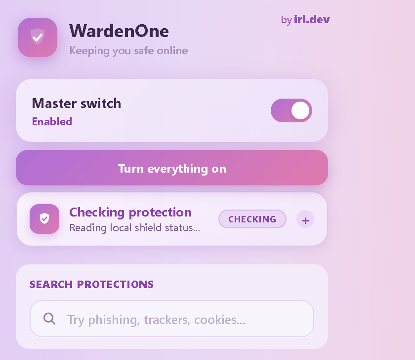
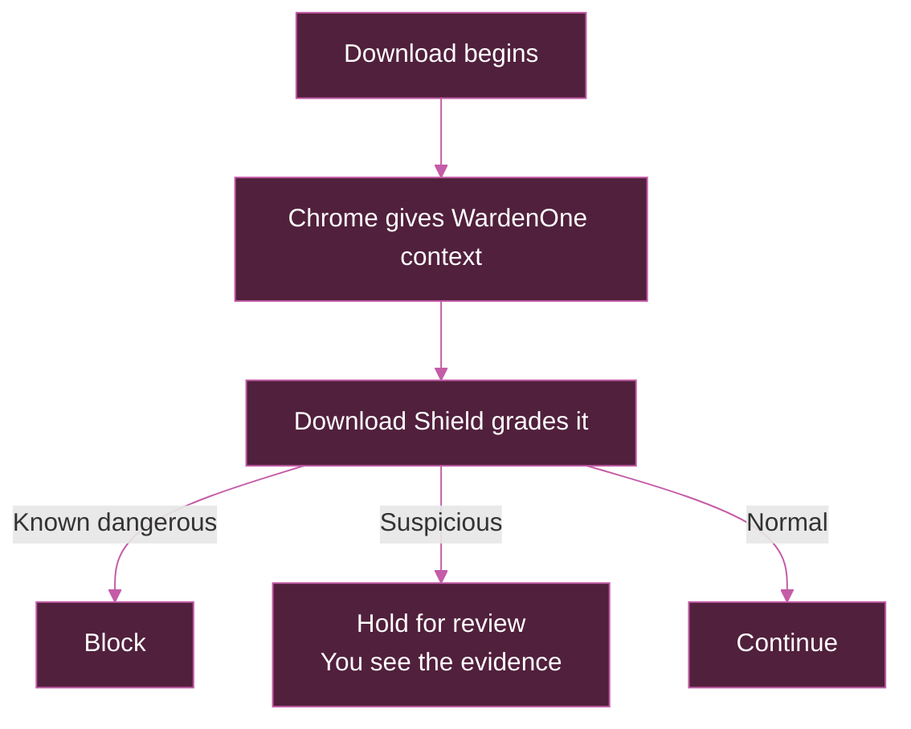
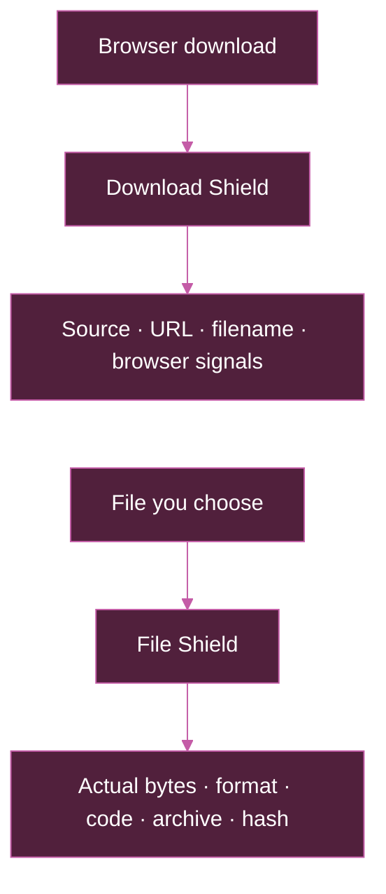
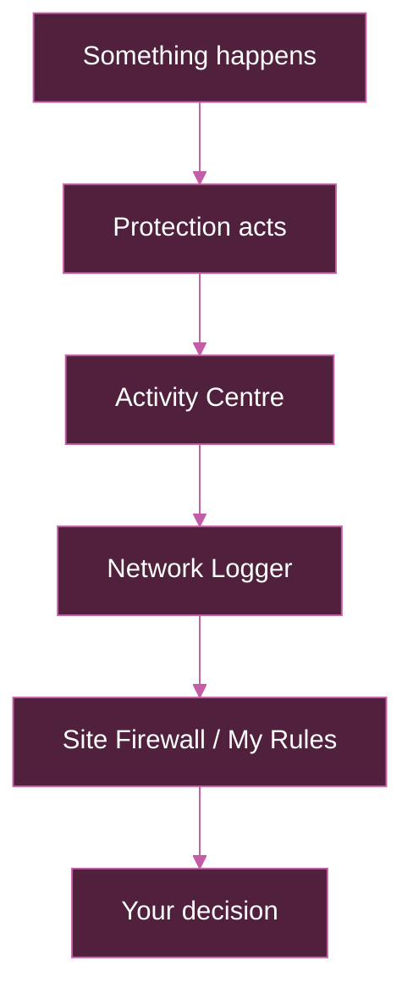

<div align="center">


# WardenOne

<p><strong>One extension. Every defence.</strong></p>

**Local-first protection against scams, credential theft, malicious downloads, trackers,
fingerprinting, pop-ups and forced redirects—plus security for browser extensions and the
network beneath them.**

[](LICENSE)
[](manifest.json)
[](https://github.com/iri-dev/WardenOne/releases/download/latest-build/WardenOne-latest.zip)


[](LICENSE)
[](https://github.com/iri-dev/WardenOne/issues/new/choose)

</div>

> ### No account. No telemetry. No WardenOne tracking. No remote browsing proxy.
>
> **No WardenOne backend · Entirely open source · Local-first by design**
>
> WardenOne has no account service, analytics pipeline or developer-operated browsing server.
> Your browsing and security data stay on your device. Only when you choose a clearly labelled
> external check does the minimum needed leave your device, and the check tells you exactly what it sends.

> [!WARNING]
> **Official builds only.** WardenOne is a browser extension, never an `.exe`, installer or setup program. Download it only from [github.com/iri-dev/WardenOne](https://github.com/iri-dev/WardenOne). If you received another copy, read the [impersonation incident notice](https://iri-dev.github.io/WardenOne/stolen).

> ## One master switch. 106 protections.
>
> **103 individually controllable · 3 watch-only**
>
> **Background Reports**, **Hardware & File Access** and **Browser Capabilities** are watch-only:
> they record important activity without blocking or changing the page, so deliberately have no
> individual switch.

WardenOne works across the network, page, session, download, storage and extension layers—and shows
you the evidence behind the decisions it makes.

**Inspect it for yourself:** [Privacy policy](PRIVACY.md) · [Permissions explained](permissions.html) · [Security policy](SECURITY.md) · [Source](https://github.com/iri-dev/WardenOne) · [Licence](LICENSE)

<p align="center">
  
</p>
<p align="center"><em>One master switch, live protection health and a searchable route to every control.</em></p>

# Quick install

1. Download [WardenOne-latest.zip](https://github.com/iri-dev/WardenOne/releases/download/latest-build/WardenOne-latest.zip) and unzip it somewhere you intend to keep it.
2. Open `chrome://extensions` and enable **Developer mode** in the top-right.
3. Select **Load unpacked**, then choose the unzipped folder containing `manifest.json`.

## First run

Choose **Recommended** for WardenOne's compatibility-conscious defaults, or **Maximum
Privacy** for a more aggressive set that enables extra fingerprinting, first-party tracking,
breach, clipboard, referrer and link protections. Maximum Privacy can change how some sites
behave; every included protection can be changed later.

Choose **Normal** notifications or **Silent mode**. Silent mode keeps protection running but
hides routine pop-ups and badges. The Notification Centre remains available when you want to
review or change individual notices.

<p align="center">
  
</p>
<p align="center"><em>First run explains the trade-off before WardenOne changes anything.</em></p>

<details>
<summary><strong>Updating an unpacked installation</strong></summary>

The rolling ZIP is rebuilt after every passing update to `main`, but an unpacked extension
does **not** update itself from GitHub.

1. Export a settings backup from WardenOne before a major update.
2. Download and unzip the newest build.
3. Keep your installed WardenOne folder at the same path and replace its contents with the new build.
4. Open `chrome://extensions` and press **Reload** on WardenOne.

Keeping the folder path matters: without a fixed manifest key, Chromium may treat a different
unpacked path as a different extension, and its local settings will not automatically follow.

</details>

**Compatibility:** Chrome, Brave, Edge, Opera and other Chromium-based browsers.
<sub>Minimum supported Chromium version: 121.</sub>

# Why WardenOne exists

Staying safer online usually means bolting together an ad blocker, anti-tracker,
fingerprinting tool, pop-up blocker, download scanner, script controller and tab manager—then
hoping they agree. WardenOne brings those layers into one system and adds the phishing,
credential-theft, extension-security and verification tools ordinary content blockers leave out.

Three ideas shape the whole product:

- **Evidence before reassurance.** “Nothing found” is never rewritten as “safe”.
- **Visible failure.** Unsupported rules, missing components and uncertain verdicts are shown rather than silently ignored.
- **Narrow recovery.** Pause one site, disable one protection there, undo one firewall decision or trace one rule before resorting to a global switch.

## Unknown does not mean safe.

WardenOne deliberately refuses to turn missing evidence into reassurance.

A file with no structural warning is not called harmless. An extension absent from the local
catalogue is not called trusted. A search result with no reputation match gets no green tick.
A privacy check that cannot actually be measured is marked untestable.

**The safest answer WardenOne can give is sometimes “I don't know”.**

# Why the name **WardenOne**?

**Warden** is the role: standing watch over the browser and stepping in when the evidence says
something is wrong. It is meant to protect without pretending to know more than it does.

**One** is the architecture. WardenOne is not an ad blocker sitting beside an unrelated phishing
tool, privacy tool, download scanner and extension checker. Those systems share context, evidence
and controls. A suspicious redirect can inform a scam warning. A download can use the reputation
of the page that started it. A broken site can be traced through the same activity and filtering
system that made the decision.

So **One** means one coordinated defence system across the browser's security and privacy layers.
It does **not** mean one extension can stop every online threat. No browser extension can promise
that.

<p align="center">
  
</p>

# Security

**Scams do not all look like malware.** Some steal credentials. Some impersonate the browser.
Some abuse permissions, redirects, clipboard access or the assumptions people already make.
WardenOne covers those surfaces separately because they fail in different ways.

## Threat Blocklist

Known malicious, phishing and scam destinations are stopped at the browser's network layer
before their pages load. WardenOne ships built-in rules and can fetch fresh vetted feeds each
day; tens of thousands of domains are available locally and the upstream feeds cover millions.

A failed update keeps the last working copy rather than creating a gap. The update request asks
for a public list file; it does not contain your history or the page you are visiting.

## Phishing & Look-Alike Protection

WardenOne blocks `g00gle`-style substitutions, wrong-TLD brand impersonation and international
homographs that render like a familiar name. Brand text, password forms, destination ownership
and other context are combined so an innocent mention of a company is not enough to condemn a
page.

The optional login-page age check adds a different signal: a password form on a domain registered
very recently. It sends only that domain—not its path, page contents or anything you typed—to
RDAP when enabled, then caches the answer locally.

**Find it:** WardenOne → Advanced detection.

## Insecure Sign-in Guard

The warning appears when you focus a password field on an unencrypted page, before anything has
been typed. It also catches the subtler version: a page itself uses HTTPS but its form posts the
password to plain HTTP. Router and other deliberate local-network logins are left alone, and the
warning offers the secure version when one exists.

## Browser-in-the-Browser Protection

You click **Sign in with Microsoft**. A convincing Microsoft window appears, with a title bar,
address bar and close button. Except no browser window ever opened—the site drew the entire thing
inside its own page and owns the password form inside it.

WardenOne warns on the combination that matters: a window-shaped interface claiming a domain the
page does not own and somewhere to enter credentials. Ordinary login modals are not treated as
fake windows merely for being modal; online IDEs, design tools and normal media surfaces are
excluded.

<details>
<summary><strong>How detection stays narrower than “this looks like a window”</strong></summary>

The shape alone is weak evidence. WardenOne looks for browser furniture, foreign-domain text,
credential entry and the relationship between the displayed identity and the real top-level site.
It does not trust a screenshot or a single CSS class. That makes the detector less theatrical and
far more useful: a mock browser used in documentation stays quiet, while a fake identity window
asking for a password has several signals at once.

</details>

## Full-screen Address Guard

Full screen removes the real address bar. A hostile page can then paint its own at the top and ask
for a password while the one reliable identity signal is gone. WardenOne warns when a full-screen
page draws a domain it does not own alongside sensitive input and offers to leave full screen.
Video, games, slideshows and maps are deliberately exempt unless the spoofing evidence is present.

## ClickFix & Command Paste Guard

ClickFix scams turn the victim into the malware launcher: “prove you are human”, press `Win+R`,
paste a command, or open DevTools and type what the page prepared. WardenOne recognises the
instruction sequence, blocks suspicious programmatic clipboard writes, warns on dangerous copied
selections and raises the severity when the instruction and command evidence occur together.

> **Fake instruction → prepared command → clipboard intervention → clear warning → redacted local event**

It does not and cannot read Chrome's own DevTools interface. The protection runs on the page and
the clipboard actions the page initiates; it intervenes before the pasted command leaves that
context.

## Fake Update & Tech-support Scam Protection

Real Chrome, Windows and browser updates do not arrive from an arbitrary web page. Fake Update
Detection looks for vendor impersonation combined with installer downloads or off-site action
buttons. Tech-support Scam Guard handles the other familiar performance: “your computer is
infected”, a telephone number and dialog spam intended to lock the browser. It neutralises the
locker, frees navigation and explains that the page—not the computer—is producing the alert.

## Notification Scam Protection

Notification bait is caught while a page is coaching you to press **Allow** through fake CAPTCHAs,
download steps or invented security warnings. The wording is classified locally and not retained;
only the kind of event reaches the Activity Centre. A push notification created later by a service
worker exists outside the page, which is an honest boundary for a content-script detector.

## XSS Behaviour Guard

The guard watches values arriving from the URL, `window.name`, `postMessage` or the referrer for a
path into a place where code actually runs. It records the source, sink, confidence and severity
without storing the matched value itself.

This is behaviour evidence, not a claim that WardenOne found or blocked every cross-site scripting
vulnerability. Page-originated findings remain warnings and cannot silently manufacture a blocking
rule.

## Anti-clickjacking

Before a click that matters—sign in, password, checkout, payment, transfer, authorisation, allow or
install—WardenOne checks whether the target is hidden, covered or materially different from what it
appears to be. Ordinary visible buttons remain ordinary. The protection is about a sensitive click
landing somewhere concealed, not about disliking layered page layouts.

## Redirect, Pop-up & Back-trap Protection

Forced popups and popunders, timer-opened ad tabs, gestureless redirects, CPA chains, meta-refresh
bounces, download-ad gates, deceptive confirmation prompts and frames that spend your click on an
unrelated destination are handled as related but distinct tricks. In-page overlays can be removed
with an Undo chip; real payment forms, CAPTCHAs, logins and media controls are guarded by structural
compatibility exemptions.

Back-button protection refuses repeated re-add, stack and shove-forward patterns without deleting
anything already in history or navigating on your behalf. A normal interaction vouches for the
history changes that follow it, which is what keeps galleries and single-page applications working.

<details>
<summary><strong>Why bounce cleanup is deliberately conservative</strong></summary>

A redirect tracker briefly becomes first party between the site you left and the site you reached.
That moment lets it set storage that third-party cookie blocking cannot touch. WardenOne already
knows the redirect chain, so it can clear what a verified tracker hop left behind.

The restraint is the feature. A hop is cleared only when it was passed through, is already on a
blocking list and does not resemble login or payment plumbing. The requested page, final page and
ambiguous intermediaries are left alone. A tracker whose state survives is an acceptable miss; a
sign-in destroyed halfway through is not.

</details>

<p align="center">
  
</p>
<p align="center"><em>When WardenOne stops a page, the intervention explains why.</em></p>

## SessionShield

**PROTECTION SUITE · LOGIN & SESSION SECURITY**

**What it does:** SessionShield protects the state that exists after a successful login: session tokens, cookies,
password and card fields, OAuth grants, clipboard operations and the places a site stores identity.
It never records or displays a full token, password or card number.

This is a subsystem in its own right. Its parts can be controlled individually because protecting
a token in transit, spotting a skimmer and warning about a risky paste are different decisions with
different compatibility costs.

**Find it:** WardenOne → SessionShield — login & session protection.

### Session Token Guard

SessionShield finds token-shaped values exposed in URLs, cookies and script-readable storage. The
continuous watch catches new values the moment they are written after login rather than scanning
only on page load. Token Guard then prevents those exact values from leaving for an unrelated
domain through fetch, XHR, beacons, WebSockets, forms and the equivalent paths inside embedded
frames.

Known noisy services can be treated more calmly in the local log without weakening the actual
protection. The token itself is never copied into the Activity Centre to explain that it was saved.

> **Token appears → exact value is watched locally → unrelated destination is blocked → event is recorded without the token**

### Form Skimmer & Magecart Guard

Third-party scripts reading password or payment fields are suspicious; those values leaving for an
off-site address are stronger evidence. WardenOne observes both and blocks the exfiltration path,
including forms and request APIs inside embedded frames, where many hosted payment fields live.

The guard follows the credential value and destination relationship rather than treating every
third-party script on a checkout as malware. Legitimate payment processors and identity providers
need to read the fields they own.

### Payment Card Guard

Payment Card Guard warns before card details leave a scammy, very new, suspicious or
reputation-flagged checkout. It blocks submission on insecure, look-alike, raw-IP and
known-dangerous forms.
Embedded frames receive a lightweight card-exfiltration guard; full checkout and reputation
analysis stays with the top page, where the site identity is meaningful.

### Autofill Trap Guard

A page can hide username or password fields where you cannot see them and wait for the browser or
password manager to fill them. WardenOne looks for autofilled credential fields with no visible
login that explains their presence. A normal login that fills both its visible and hidden support
fields is not enough; the trap requires the hidden credential behaviour and missing visible context
together.

### Paste Protection

Paste Protection warns before a password, API token, private key or seed phrase is pasted into
an insecure page, look-alike domain or form posting elsewhere. Normal secure login forms stay quiet.

### Clipboard Hijack Protection

Clipboard Hijack Protection can stop a site from replacing what you copied—for example changing
a cryptocurrency address to the attacker's.

### Clipboard Swap Detection

Clipboard Swap Detection checks again at paste time: when a recently copied and pasted address
name the same currency but differ, it shows both for comparison. That second check can expose a
swap performed by malware outside the browser, without sending either address anywhere.

### OAuth Grant Guard

Google, Microsoft, GitHub and Discord consent pages can grant far more than a simple sign-in.
WardenOne warns when the requested combination includes sensitive mail, contacts, repositories,
administration, long-lived offline access or an unsafe redirect. It does not block ordinary OAuth
by brand name; the scope and redirect relationship are the evidence.

### Honeytoken Mode

Experimental Honeytoken Mode places fake decoy secret names in page memory only where the site does
not already use them. A script reading one is credential-reconnaissance behaviour because ordinary
site code has no reason to know it exists. The decoy yields rather than colliding with a real page
property.

### Keystroke Pressure Detection

Keystroke Pressure Detection warns when a page attaches an unusually large number of global key
listeners. Rich editors and chat applications can legitimately do the same, so it is described as
a noisy heuristic and is off by default—not promoted as certain keylogger detection.

### Breach & Password Checks

The site-history tool can ask Have I Been Pwned whether a domain appears in public breach records.
The separate password check hashes the text locally and sends only the first five characters of the
hash, receiving a large range of possible matches in return. WardenOne does not read passwords from
website fields, saves no answer and never sends the password or full hash.

These checks are optional and clearly leave the device. They run because you asked a specific
question, not as background telemetry.

### Session Security Grade

The current site receives an A–F session-security grade based on connection security, JWT exposure,
token storage and cookie properties. The grade is evidence to inspect, not a warranty that the
account cannot be compromised.

### Emergency Logout

If you think an account already has been compromised, Emergency Logout can clear cookies and session data for this
site or sign out everywhere in one deliberate action. It is kept separate from ordinary privacy
cleaning because its purpose is incident response, not housekeeping.

## Download Shield

**AUTOMATIC PROTECTION · DOWNLOAD CONTEXT & REPUTATION**

**What it does:** grades browser downloads from their origin, identity and behaviour before they finish.

**One tool sees the journey. The other sees the bytes.** WardenOne keeps both because neither kind
of evidence can honestly stand in for the other.



| | Download Shield | File Shield |
| --- | --- | --- |
| **Question** | Should this browser download finish? | What is actually inside this local file? |
| **Evidence** | Source page, URL, name, type, browser signals, lists and optional reputation | Real bytes, format, structures, scripts, archives, documents and hashes |
| **Access** | Automatic for downloads Chrome reports | Only after you explicitly choose or drop a file |
| **Boundary** | Cannot freely read the saved file | Cannot observe how the file originally arrived |

**When a download begins**

1. **Observe** — Chrome reports the source page, URL, filename, type and browser signals.
2. **Grade** — WardenOne combines that context with publisher trust, local lists and any optional intelligence you enabled.
3. **Decide** — known dangerous downloads are blocked, risky ones are held for review, and ordinary ones continue.
4. **Explain** — the Download Review shows why the A–F grade changed and lets you cancel or continue where continuation is allowed.

Clean downloads from exact publisher-controlled installer hosts can stay quiet. Shared cloud and
CDN families are not trusted wholesale, and disguise tricks or known-malware evidence always beat
publisher reassurance.

Optional providers include domain age, Google Safe Browsing, VirusTotal, URLhaus, AbuseIPDB,
OpenPhish, PhishTank and WhoisXML. Each has its own control and disclosure; there is no hidden
WardenOne reputation backend.

**Find it:** WardenOne → Download Shield.

## File Shield

**LOCAL TOOL · FILE STRUCTURE & HASH ANALYSIS**

**What it does:** examines the real bytes of a file you choose without opening, running or uploading it.

The file tells you one thing. **Its bytes may tell you another.**



Chrome does not give an extension arbitrary access to saved files. Even for a download it watched,
re-fetching the URL can produce different bytes when the link is signed, personalised or one-time.
File Shield therefore reads only the actual file you explicitly hand it. Nothing is uploaded,
opened, extracted or run.

**What File Shield reads**

- **Real format** — file signatures expose a Windows program renamed `holiday-photo.jpg`, double extensions, right-to-left overrides and padded names.
- **Windows programs** — signatures and signer names, imported capabilities, packing, networking, process launch, service installation and process-injection indicators.
- **Scripts** — batch, PowerShell, VBScript, JavaScript and HTA shown as written, with lines that download, decode, persist, disable protection or destroy backups called out.
- **Shortcuts** — the actual command a Windows `.lnk` file would run when double-clicked.
- **Archives** — the index is inspected without extraction for executables, path traversal, encryption, nesting, macros and files claiming to expand enormously.
- **Documents** — Office macros and PDF actions able to run scripts, launch programs or carry embedded files.
- **SHA-256** — checked locally against the known-malware hashes bundled with WardenOne. A match identifies those exact bytes.
- **Optional VirusTotal lookup** — one deliberate button sends only the SHA-256 using your own API key. It never sends the file or filename.

Several files or a folder's worth can be dropped together, and the report can be copied for the
person who supplied the file.

**It never says “safe”**

File Shield reads structure, not future behaviour. It can say a file is disguised, contains code,
imports a dangerous capability or matches a known hash. It cannot prove a file harmless, and it
never pretends otherwise. A clean result means **nothing here is disguised by the checks that ran**.
It is not antivirus: it does not monitor the filesystem, emulate behaviour, quarantine anything or
replace the protection already on your computer.

**Find it:** WardenOne → Download Shield → Open File Shield.

## Network and device defence

**PROTECTION SUITE · IP, PRIVATE NETWORK & DEVICE ACCESS**

**What it does:** protects browser surfaces that sit beyond the visible page. Sites can ask about local addresses, reach towards private
devices, open media streams, reuse old permissions and leave background components behind.

### WebRTC & IP-logger Protection

WebRTC can reveal local network addresses without a normal page request. WardenOne limits that
surface and blocks known IP-grabber beacons and logger hosts such as Grabify-style links. The
Privacy Self-Test checks host candidates without contacting a STUN server, because the local leak
is the useful measurement and needs no external service to demonstrate it.

### HTTPS & Certificate Protection

Force HTTPS upgrades eligible navigation and request paths. Certificate failures receive a clear
WardenOne interstitial rather than a mysterious broken page. Local network exceptions remain
separate because routers and development devices often use deliberately local arrangements.

### Intranet Guard

A public web page should not be able to probe your router, NAS, printer, development server or
another private admin panel. Intranet Guard covers fetch, XHR, forms, beacons, sockets, scripts,
frames, media and background workers, whether the target is written as an IP address or a name such
as `router.local`.

Pages you deliberately opened from your own network keep access to it. The important distinction is
who initiated the relationship: a local tool reaching local resources is normal; an unrelated
public page walking the same address range is not.

### DNS Rebinding Protection

A hostname can look public and resolve to a private address only after a request begins. WardenOne
watches the addresses sites actually resolve to and blocks a public name for the rest of the
session when it points at the local network or changes from public to private—the signature of a
rebinding attack.

Chromium exposes no reliable pre-request DNS answer to extensions, so the first request that
reveals the trick has already happened. Direct private-network access is prevented; rebinding is
detected from that first resolution onwards. WardenOne does not claim to block the revealing first
request because Chromium does not expose the evidence early enough to do that honestly.

### Media Shield

Media Shield can refuse camera, microphone, screen capture and hidden background media. The
microphone protection includes speech recognition, which reaches audio through a route that a
`getUserMedia`-only guard would miss and which Chrome may send away for transcription. Refusal uses
the browser's ordinary denied-permission path so sites that handle a user pressing **Block** can
handle WardenOne too.

### Location Guard

Location blocking is individually controlled, so a site can be refused geolocation without
changing the rest of WardenOne's device and permission protection.

### Permission Chain Guard

Permission Chain Guard adds context across prompts: notifications followed by camera, clipboard,
location, screen sharing or file access can be more risky together than any one request viewed
alone.

### Site Permission Scanner

The Site Permission Scanner shows what the current site may use and lets you set camera,
microphone, notifications and location to allow, block or ask. Chrome remains the authority that
applies the setting.

### Watch-only Protections

**WATCH-ONLY · LOCAL EVIDENCE, NO PAGE MODIFICATION**

Not everything worth knowing about is worth blocking. Three systems only write a local Activity
Centre entry; Chrome already supplies the permission decision where one is needed.

<details>
<summary><strong>Exactly what is recorded—and what deliberately is not</strong></summary>

- **Background reports** — the destination of a beacon is noted once per page. Its payload is never read or stored.
- **Hardware and file access** — USB, serial, HID, Bluetooth, MIDI, XR, NFC, game controllers, files and folders, including reuse of an earlier grant. WardenOne stores the kind of access, never the device, selected path, file, folder or controller model.
- **Browser capabilities** — service-worker registration, web-app installation, idle detection and Chrome's payment sheet. Payment methods can be named; the amount and item cannot.

XR matters because an immersive session can expose continuous pose and, for AR, information tied
to the mapped room. NFC writes matter because they change a physical tag and can sometimes make it
read-only permanently. Game controllers are not treated as suspicious—the model string is simply a
fingerprinting surface, so WardenOne records the count and never the model name.

One honest limit: top-frame page instrumentation cannot see every API use inside every sub-frame.
Cross-origin frames still need permission policy from the page, but a same-origin frame can share
more of its authority.

</details>

<p align="center">
  
</p>
<p align="center"><em>WardenOne protects this browser; the guide explains how DNS filtering can extend the safety floor to other devices.</em></p>

## Extension Security Centre

**INTERFACE · INSTALLED EXTENSION IDENTITY & CHANGE HISTORY**

**What it does:** shows what every installed extension is, what it can access and what changed.

Extensions can change after installation, gain new access or arrive under a familiar name with an
unfamiliar identity. WardenOne therefore treats exact IDs, current capabilities and change history
as separate evidence.

The local Extension Security Centre inventories every installed extension's exact ID, version,
enabled state, install type, Chrome permission warnings and capability combinations. It compares
exact IDs with the incident and identity catalogue bundled on your device, without uploading the
extension list.

“Reviewed” belongs to the exact version and permission snapshot. A later update cannot inherit an
old reassurance. Broad access is explained rather than automatically called malicious, and an
unknown ID is never called safe. Explicit buttons can disable an extension or ask Chrome to confirm
its removal; WardenOne never removes one on its own.

### Extension Change Monitoring

The change watcher keeps a local timeline of versions, permissions and enabled state. Harmless
updates remain visible; newly powerful access is highlighted.

> **Version or permissions change → new local snapshot → previous state compared → difference highlighted → you review it**

### Startup Security Check

On browser launch, Startup Security Check scans restored tabs and reconciles the
installed-extension inventory without overwriting a change that happened while the extension
worker was asleep.

### Pre-install Extension Check

Paste a Chrome Web Store link or 32-character ID to check something that is not installed and never
has to be. The exact ID is compared with the same bundled incident and identity catalogue used by
the Security Centre. A documented incident remains attached to an ID after a rename.

One optional button asks the Web Store which name is currently published under that ID. It is a
separate press because it tells Google which extension you are considering; WardenOne sends only
the ID, without your cookies or Web Store session.

If no listing exists, WardenOne says **removed or never existed** because those cases look identical
from outside. If the catalogue has no record, it says **unexamined**, not cleared. Chrome does not
expose an uninstalled extension's future permissions or source code to another extension, so this
is an identity and listing check—not a code review.

### Update Guardian

The browser itself is part of the security boundary. Update Guardian detects its name and major
version, then conservatively estimates the expected Chromium generation from the release cadence.
It warns only when the browser appears several major versions behind, so an ordinary staged rollout
does not cry wolf. An extension cannot fetch a perfectly authoritative “current” version or update
the browser itself; the button opens the browser's own update page. This is security hygiene, not a
comfort extra.

<p align="center">
  
</p>

# Privacy & anti-tracking

Privacy protection is not one blocklist. A tracker may live on a third-party host, hide behind the
site's own domain, survive as first-party redirect storage, proxy an email image, fingerprint APIs
without making a request, or decorate links that other people will open later.

## Tracker protection

Known analytics and tracker infrastructure is blocked using built-in EasyPrivacy-style data and
fresh supported feeds. Do Not Track and Global Privacy Control express the corresponding opt-out
signals. Tracker-only domains receive stricter treatment than ordinary cross-site services because
there is no login or checkout there to preserve.

The filtering happens locally. Pages you visit are matched against rules on your device; WardenOne
does not send browsing events to a server to ask whether each request is acceptable.

## First-party Tracker Protection

Analytics can be proxied through the same domain as the site, making a third-party hostname list
blind to it. WardenOne detects those first-party routes and includes a local tracker learner for
repeated on-device evidence. Learned decisions remain on your machine and do not become a crowdsourced
record of your browsing.

## Cookie and storage controls

Third-party cookie blocking is joined by optional wipe-on-close and no-persistent-cookie modes.
General coverage stays conservative around embedded frames and scripts because sign-ins depend on
them; domains dedicated to measurement can be handled more strictly.

Storage Access API requests are made visible with the identity of the embedded requester. Known
trackers are refused and invisible or unprompted requests are flagged. A separate opt-in blocks
every cross-site storage request, deliberately left out of both Recommended and Maximum Privacy
because it will break some embedded logins and checkouts.

## Link hygiene

Copied links lose recognised tracking parameters and known redirect wrappers; hyperlink-auditing
`ping` attributes are removed before they can report a click. WardenOne also intercepts tracking
parameters added directly to the address bar by `history.pushState` or `replaceState`, where no
link click and no navigation exists for an ordinary cleaner to catch.

**Before**

```text
https://example.com/article?utm_source=email&utm_campaign=sale&id=42
```

**After**

```text
https://example.com/article?id=42
```

Only recognised tracking values are removed. Unknown parameters, paths and fragments stay exactly
as they were. Site-specific rules used when copying a link are not blindly applied to the live
address bar, because values such as Amazon search state or Spotify context can be part of the
application itself.

## Bounce-tracking Cleanup

Verified tracker domains passed through during a redirect can have their first-party cookies and
storage cleared after the chain completes. Requested, final, login, payment and ambiguous hops are
excluded.

## Service-worker Cleanup

A separate opt-in records sites that install service workers and can remove one after the final tab
for that site closes. It is off by default because service workers also power legitimate offline
reading and notifications; deleting one trades persistence protection for functionality until the
next visit.

## Header Shield

Header Shield reduces third-party Client Hints, can remove cross-site referrers and offers ETag
protection limited to known tracker infrastructure. First-party, sign-in, CAPTCHA and payment paths
remain excluded. A universal header rewrite would produce impressive numbers and broken sites;
narrow scope is the stronger defence.

## Consent protection

Cookie banners come in three different shapes, so WardenOne does not pretend one action fits all:

- When a real **Reject** path exists, it opens the choices if necessary, turns off optional tracking and never clicks Accept.
- When a consent-or-pay wall offers no refusal and merely covers content already present, an opt-in can lift the wall without clicking anything or writing a consent cookie. If the article was never delivered, WardenOne puts the wall back rather than leave a blank page.
- When you accepted tracking yourself, consent and tracking state can be cleared after you leave while sign-in state is preserved.

Login compatibility remains on by default because an identity hand-off can resemble a redirect,
an IdP request can resemble exfiltration and a login modal can resemble an overlay. Those flows are
excluded structurally instead of patched one site at a time.

## Mail Shield

A marketing email hides a one-pixel image with a recipient identifier in its URL. Loading it tells
the sender the message was opened, when and roughly from where. Ordinary network blocking can miss
this in Gmail because Gmail proxies remote images through `googleusercontent.com`; at the network
layer the tracker hostname has disappeared.

The information has sometimes moved rather than vanished. Gmail can retain the original address in
the fragment of the proxy link it writes into the page. A fragment is never sent to a server, which
is precisely why a blocklist cannot see it and why Mail Shield works in the webmail page instead.
It recovers the real source where the markup preserves it and neutralises the likely pixel with a
transparent image of the same declared size.

Mail Shield is registered only on Gmail, Outlook, Proton, Yahoo, Fastmail, Zoho, AOL and Gandi. It
does not inspect images on the rest of the web. Analysis stays inside the supported webmail page;
no email content or pixel address is sent to WardenOne.

<details>
<summary><strong>How it decides early enough, and where the limit lies</strong></summary>

The decision uses markup, not rendered size: once an image has measurable dimensions it may already
have loaded. Deferred `data-src` addresses are covered too. Replacing a suspected one-pixel image
with another transparent one is intentionally less destructive than removing it, because old HTML
email still uses tiny spacer images for layout.

A pixel not yet loaded can be stopped before any request. One already in flight can be cancelled,
but some bytes may have reached the network. If a provider strips every trace of the source, only
the image's shape remains. Whether the provider fetched an image on its own servers is outside what
any browser extension can observe. Mail Shield does not claim to stop all email tracking.

</details>

## Anti-fingerprinting

The opt-in shield covers canvas, audio, WebGL, WebGPU, hardware hints, fonts, monitor layout,
keyboard layout, voices and related measuring surfaces with per-session noise or fixed answers
shared by everyone using the protection.

Consistency matters more than theatrical randomness. WebGL and WebGPU receive one GPU identity;
different answers to the same question would be rarer than the real machine and therefore a better
fingerprint. WebGPU limits are reduced to specification minimums shared by the protected group.

Media capability checks keep the browser's truthful `supported` answer—lying there can make video
fail—but flatten whether a supported codec is smooth or power-efficient, which describes the GPU
generation. WebCodecs support is observed rather than altered. A burst of capability probes is
recorded separately from the shield so detection and modification are not confused.

<details>
<summary><strong>Why anti-fingerprinting is opt-in</strong></summary>

Some surfaces cannot be changed without a compatibility cost. Reporting a strong machine as not
power-efficient may lead a site to offer a smaller video rendition; blocking font or display
enumeration can affect design and conferencing tools. WardenOne keeps these choices visible and
session-consistent rather than claiming that more noise is always more private.

</details>

## Search-result protection

Google, Bing, DuckDuckGo, Brave Search and Yahoo results are annotated before the click when local
evidence already identifies malware, scams, IP loggers, look-alikes, raw-IP destinations, a site
WardenOne previously blocked or a recently registered domain whose age is already cached.

- ⛔ means a direct malware/scam or IP-logger match.
- ⚠️ means a suspicious signal worth inspecting, not a guilty verdict.
- There is deliberately no green “safe” badge.

Nothing is hidden or reordered. No result is sent to a reputation API merely to paint a badge;
doing that for every result would tell a third party what you searched for, which would be an absurd
way to run a privacy extension. When you want a network-backed answer about one link, choose **Check
this link** yourself.

<p align="center">
  
</p>

# Control and verification

> **A green switch is configuration. It is not proof.**

WardenOne gives you several ways to challenge what it claims: see the event, inspect the request,
measure what the page received, check the internal components and repair what is missing.



## Activity Centre

**INTERFACE · LOCAL SECURITY EVIDENCE**

**What it does:** keeps the explanation after a protection blocks, warns, learns or allows.

The Activity Centre keeps the most recent security events on this device: what WardenOne blocked,
warned about, learned or allowed, with enough context to understand the decision. It is not a remote
dashboard. There is no account and the history is not uploaded for analytics.

Sensitive event types are deliberately redacted. A warning about a token, clipboard value or
ClickFix command should not reproduce the secret or harmful payload merely to prove it saw one.

<p align="center">
  
</p>
<p align="center"><em>The event history stays on this device and preserves the reason without copying the secret.</em></p>

## Notification Centre

**INTERFACE · NOTICE CONTROL**

Every notice WardenOne can show is listed with what it means, how long it remains visible and
whether you would rather not see it again. Muting presentation never turns off the protection
behind the notice. Silent mode is therefore a user-interface choice, not a weaker security profile.

## Protection Health

**LOCAL CHECK · EXPECTED COMPONENTS & RULES**

Protection Health asks whether the expected engines, registrations, lists and page components are
present and responding. It does not equate “setting saved” with “protection running”, and a failure
replaces the reassuring state instead of being hidden beneath it.

## Privacy Self-Test

**VERIFICATION TOOL · MEASURED PAGE RESULTS**

The Self-Test measures the page in your active tab, not its own extension page. Each probe runs
twice in the same document: once through WardenOne's protected browser APIs and once through clean,
untouched copies. **Protected** means the page demonstrably received a different value—not that a
toggle was on.

It measures canvas drawing and readback, audio, WebGL/WebGPU identity, machine hints, displays,
Client Hints, voices, keyboard layout, media capabilities, local WebRTC addresses, battery and
connection data, font access, game controllers, hyperlink auditing and tracking values in links or
the address bar.

Verdicts are contextual: ✅ Protected · 🟢 Minimal exposure · 🟡 Partly protected · ℹ️ Allowed by
design · 🔴 Exposed. A shield you chose to disable is a choice, not a failed test, and the score
counts only checks with a meaningful right answer.

<details>
<summary><strong>What the Self-Test refuses to pretend it measured</strong></summary>

Whether a real third party received a referrer and whether a tracker request reached a server both
need a cooperating server at the other end. WardenOne has none. Contacting a tracker to find out
whether contacting trackers is blocked would perform the very action being tested, so those checks
are labelled **not testable here** instead of receiving an invented green tick.

Nothing leaves the device. The WebRTC probe uses no STUN service, temporary nodes are removed and
the address bar is restored even if a probe fails.

</details>

## Verify and Repair

**RECOVERY TOOL · LIVE PAGE COMPONENTS**

When a switch says on but the Self-Test receives the native value, Verify & Repair looks from the
inside: it checks the WardenOne components expected on that tab and re-injects what is missing. The
Self-Test can then be run again from the outside. The two tools answer different questions, which is
why one cannot simply print the other's result.

```text
Protection enabled
        ↓
Protection Health
        ↓
Privacy Self-Test
        ↓
Verify & Repair
        ↓
Test again
```

## Per-site control

**103 of the 106 protections have their own toggle**. The other three are watch-only systems: they
record an event but never block or alter a page, so there is no individual blocking decision to
switch.

When one protection misreads one site, the **This site** panel offers a ladder rather than a cliff:

1. Pause WardenOne here for 15 minutes, one hour or eight hours.
2. Turn off one protection on this site only.
3. Permanently allowlist the site only when the broader decision is intended.

A site override can turn a protection off, never silently enable something globally. Temporary
pauses do not force a reload and throw away a half-filled form.

**Logger → evidence. Firewall → contextual decision. My Rules → precise policy. Custom Lists →
maintained policy.** They form one control system, not four unrelated advanced buttons.

## Network Logger

**INVESTIGATION TOOL · REQUEST, OUTCOME & MATCHING RULE**

The Activity Centre tells you a security event happened. The Network Logger tells you **which
request it was, whether WardenOne blocked or allowed it, and which rule decided**. That is the place
to start when a site breaks instead of switching protections off at random.

Each row shows the request type, page, first- or third-party relationship, outcome and matching
source. A row can become a rule that blocks the exact host, whole domain or path, or allows it back;
all four write to My Rules so the decision is not hidden in another store.

Capture exists only while a logger page is open. The in-memory buffer is capped at 1,000 requests
and dropped when the last logger closes. Token-, key-, password- and address-like values become
`[removed]` before the request is recorded. Nothing reaches disk until you press Export.

## Site Firewall

**CONTROL SURFACE · PER-SITE NETWORK POLICY**

The Site Firewall shows every domain the current page loads and lets you decide whether each may
run scripts, make requests, load frames or media, or carry cookies **on this site only**. Your
decision beats the shipped lists in that context.

This is powerful enough to break a page outright, so WardenOne does not disguise it as a friendly
global switch. Undo is always one click for this site or everywhere, and the matrix makes the scope
visible before the decision is stored.

## My Rules

**CONTROL SURFACE · PRECISE PERSONAL POLICY**

Personal rules use familiar Adblock syntax:

```text
||ads.example.com^       block a host
@@||example.com^         allow a site back
example.com##.promo      hide an element on one site
##.promo                 hide an element everywhere
```

Import and export use plain text. Anything WardenOne cannot apply is listed with its line number
and the reason instead of being silently saved. A stored rule that does nothing is worse than a
refused rule because it leaves you believing you are covered.

## Custom Lists

Subscribe to a country-specific annoyance list, niche tracker list or one you maintain yourself.
Each subscription has its own switch, last-update status, rule count and manual refresh.

Fetches require HTTPS and reject private addresses, strange ports and redirects onto them. A failed
refresh keeps the last working copy. The list host learns that the public list was requested; it
does not receive your browsing history or a report of which rules matched.

## Script Shield

Script Shield can block JavaScript and WebAssembly everywhere, block scripts on one site, allow only
trusted third-party script hosts or filter known fingerprinting scripts. Lockdown and Smart modes
are separate because “this page will stop running scripts” and “untrusted third-party scripts will
be limited” are materially different promises.

<p align="center">
  
</p>

# Content blocking

Ad blocking remains a substantial part of WardenOne. It simply is not allowed to define the whole
product before the security systems appear.

## AdShield

AdShield combines network filtering, cosmetic rules and anti-adblock scriptlets using the same
formats and ideas familiar from EasyList, AdGuard and uBlock-style ecosystems. Shipped rules,
personal cosmetic removals and custom list provenance remain distinguishable so one allow decision
does not undo something unrelated.

## YouTube AdShield

YouTube ad breaks are removed by pruning the ad schedule from player data rather than painting a
black cover over the advert or racing a skip button after it appears. Pre-roll and mid-roll data,
companion UI and player changes are handled together while account refreshes, captions, playback
controls and slider interactions retain their normal paths.

YouTube changes frequently. Compatibility checks and a site-specific pause exist because a video
that will not play is a failed protection, not a successful block.

## Twitch AdShield

Twitch stitches adverts into live streams, so ordinary request blocking can freeze the player or
leave it looping. WardenOne asks Twitch for another local, Twitch-signed clean stream session and
keeps the HLS sequence continuous while switching. Display and picture-in-picture adverts are
declined before their creatives load.

No third-party proxy handles the video. If Twitch offers no usable clean session, playback fails
open rather than freezing or looping behind a cover. That boundary is deliberate: keeping the
stream usable matters more than claiming a block that left nothing watchable.

## Search cleanup

Sponsored Google and Brave results and their ad-click wrappers can be removed. Google and Brave AI
answer panels are optional. Google's native plain-Web mode requests ten blue links at the source,
so there is no enriched panel to flash in before a selector hides it.

Answer-scraper results are dimmed and labelled with **Show anyway**, never silently deleted. A
blocking failure is visible; a search filter that hid the one useful result would fail invisibly,
which is the more dangerous mistake.

## Element Zapper

Point at a sticky bar, leftover consent box, sidebar or floating video and remove it. The result is
saved locally for that site through the same cosmetic channel as personal rules. `Ctrl+Z` can undo
several removals even after the tool closes, and large selections require confirmation whether you
use the mouse or keyboard.

Allowlisting a site's adverts does not silently restore an element you explicitly chose to remove.
Those are two different decisions and remain so in storage.

## Cryptojacking protection

Known mining-as-a-service scripts, third-party mining-pool traffic and stratum WebSockets are
blocked while a mining pool remains reachable when you deliberately visit it. Optional deep
detection examines the code of background workers for mining routines and stops the worker,
including replacements a miner spawns, without killing the rest of the page.

Heavy CPU usage by itself is never called mining. A video export, WebAssembly build and miner can
all peg the same cores; WardenOne uses visible mining code as evidence and accepts that obfuscation
can produce a miss.

<p align="center">
  
</p>

# Tools, performance and comfort

## Right-click tools

One **WardenOne** context-menu entry contains Element Zapper, Copy clean link, Block this site,
Check this link, Check selected text, Where is this image from? and What is this frame? These are
routes to evidence or actions you may need before opening the main controls.

Copy clean link exists separately from automatic in-page copying because Chrome's own **Copy link
address** command and the address bar are browser UI that a page script cannot intercept.

## Command Palette

Press **Alt+Shift+W**, type a few letters and choose a WardenOne action: check the site, run the
Self-Test, hide an element, clean the page address, pause here, open the Logger or Firewall, check a
file or extension, inspect Activity, or open settings.

<details>
<summary><strong>Why the in-page palette cannot grant itself authority</strong></summary>

The overlay is display only. The background owns the command list, rejects unknown IDs and requires
the palette to have been opened on that exact tab through a trusted route. The opening is consumed,
so one invocation buys one action. A forged page message cannot create that authority.

The palette is injected only when called and lives in a closed shadow root. The page cannot read
what you type into it or restyle its internal controls into something misleading.

</details>

## Keyboard Shortcuts

Repeated actions use Chrome's native extension shortcut system rather than a key listener injected
into every page. Pages cannot see or swallow those shortcuts, and you can rebind them at
`chrome://extensions/shortcuts`. Chrome allows four defaults; later or additional commands appear
as **Not set** until you choose a key.

## Forget Me & Logins

Forget Me & Logins clears a site's cookies and storage after its last tab closes, preserving
allowlisted sites, and offers a one-click clear-now action.

## Privacy Cleaner

Privacy Cleaner separately selects cache, consent and tracking cookies, all sign-ins, history,
download history, local storage, service workers, saved form data or camera, microphone and
location permissions over a chosen time range.

## Settings Backup

Settings backup exports every toggle to a file you keep. API keys are never included, and unknown
fields in an imported file cannot inject one. With no account and no WardenOne cloud sync, this is
the deliberate route for moving your configuration.

## Memory Shield

Memory Shield sleeps inactive tabs using Gentle, Balanced, Aggressive or Emergency profiles. Pinned,
audio, form, login and payment tabs can be protected from sleeping; duplicate and zombie tabs can
be found, and memory can be freed on demand.

## Resource Saver

Resource Saver controls autoplay media, background throttling, lazy image loading, prefetch and
preload. These are performance choices, kept separate from security verdicts.

## EyeShield

EyeShield remembers per-site Normal, Light, Dark or OLED-black Ultra display modes with brightness,
contrast, saturation, warmth and greyscale controls.

## WardenOne Themes

Light and dark themes extend across WardenOne's own pages while preserving warning, status and
disabled-control contrast.

## Twitch Local Rewind

Twitch Local Rewind lets you scrub backwards through a live stream or jump to the moment you
joined. VOD Rewind complements it for recorded content. These are comfort features, clearly apart
from the ad and security engines.

## Adult-site Arrival Screen

An optional adult-site arrival screen handles listed and heuristic matches so a mistyped address or
gestureless redirect does not immediately reveal explicit material.

## SafeSearch & Restricted Mode

SafeSearch enforcement for Google, Bing, DuckDuckGo, Brave Search and Yahoo, plus YouTube Restricted
Mode, is separate and off by default because it changes what search and video services show.

<p align="center">
  
</p>

# Privacy, permissions & transparency

WardenOne asks for broad browser access because it protects broad browser surfaces: requests,
pages, downloads, cookies, sessions, site permissions and installed-extension changes. That reach
deserves a ledger, not a slogan.

<p align="center">
  
</p>

The bundled [permissions guide](permissions.html) maps every permission to its job and where its
reach stops. [PRIVACY.md](PRIVACY.md) documents stored data, network traffic and optional services
in full.

The promise repeated throughout this page is the same here:

- **No account and no telemetry.** There is no developer-operated browsing backend or analytics stream.
- **Open source.** The extension code, interfaces, tests and bundled rule data are inspectable in this repository.
- **Local protection.** Activity, settings, learnt tracker evidence, file analysis and extension-ID matching stay on your device.
- **Secrets remain secrets.** Login tokens and passwords are never stored or transmitted by WardenOne.
- **External checks are explicit.** A domain, URL, extension ID, hash or k-anonymous prefix leaves only for the specific optional question you enabled or asked.
- **Files are not uploaded.** File Shield's VirusTotal button sends only SHA-256, only when pressed and only with your own key.
- **Updates are not telemetry.** Rule updates download public list files and disclose no browsing history; failures retain the previous local copy.

# How WardenOne works

There is no WardenOne server in the middle of your browsing. The work is split across the browser
surfaces that actually hold the evidence:

- **Browser network layer** — filtering, known threats, redirects, downloads and private-network boundaries.
- **Page and session layer** — deceptive interfaces, credential flows, privacy APIs, links and device-use signals.
- **Extension worker** — local state and the browser APIs that join those layers together.
- **Local interfaces** — Activity, Self-Test, Repair, Logger, Firewall and review tools that explain and control the result.

Some tools overlap in subject but not evidence. Download Shield sees browser context; File Shield
sees bytes. Activity records the event; Logger names the request and rule. Self-Test measures from
outside; Verify & Repair inspects from inside. Extension identity history and current permissions
answer different questions. Keeping those distinctions is what stops one convenient score becoming
a false promise.

# How I build WardenOne

My local copy is usually a good way ahead of what's pushed here.

I build in VS Code with the extension loaded, and I'll happily sit with one thing for
hours — edit, reload, hard-refresh, watch what the page actually does, go again. Almost
none of that is worth a commit on its own, so I push once something is finished and I'm
actually sure about it. The history goes quiet and then several commits land at once,
which is usually just one long session finally ending. Probably more of those at 2am
than is strictly sensible.

Everything goes through `node tools/check-maintainability.js` first. And when something
turns out to be wrong on a real site, I'd rather leave the revert sitting in the history
than tidy it away.

# Official source & authenticity

**Website:** [iri-dev.github.io/WardenOne](https://iri-dev.github.io/WardenOne/)

**Author:** [iri](https://github.com/iri-dev) (`iri-dev` on GitHub) · [iri-dev.github.io](https://iri-dev.github.io/)

Releases come only from [github.com/iri-dev/WardenOne](https://github.com/iri-dev/WardenOne).
WardenOne is never distributed as an executable installer. In August 2026 somebody republished the
project under another account and pointed its downloads at a credential stealer. GitHub removed the
account and site. The [incident page](https://iri-dev.github.io/WardenOne/stolen) records the file
details, antivirus verdicts and recovery steps for anyone who ran the false copy.

Because a browser security extension holds meaningful permissions, source authenticity matters. A
build from another repository, file host or website was not produced by this project, even if the
screenshots and description were copied exactly.

# Feedback & security reporting

Found a site WardenOne breaks, a false positive or an idea? Use the public
[issue forms](https://github.com/iri-dev/WardenOne/issues/new/choose). The site URL and protection
involved are the most useful starting details for compatibility reports.

Found a vulnerability in WardenOne itself? **Do not put exploit details, secrets or live harmful
payloads in a public issue.** Read [SECURITY.md](SECURITY.md) and use GitHub's
[private vulnerability report](https://github.com/iri-dev/WardenOne/security/advisories/new).

# Licence & credits

Copyright (C) 2026 iri. WardenOne is licensed under the **GNU General Public License v3 or later**;
see [LICENSE](LICENSE), [NOTICE](NOTICE) and [CREDITS.md](CREDITS.md). Modified redistribution is
welcome under the licence, with changes marked and notices kept intact.

WardenOne builds on the open-source blocking community, including AdGuard, EasyList, EasyPrivacy,
TwitchAdSolutions, scamorza/TwitchAdBlock, GosuDRM/TTV-AB and uBlock Origin uAssets. The complete
source and attribution list is in [CREDITS.md](CREDITS.md).
