<div align="center">


# WardenOne

<p><strong>One extension. Every defence.</strong></p>

**Blocks scams, password theft, dodgy downloads, trackers, fingerprinting, pop-ups and forced
redirects. It keeps an eye on your other extensions too. And it all runs on your device.**

[](LICENSE)
[](manifest.json)
[](https://github.com/iri-dev/WardenOne/releases/latest/download/WardenOne-latest.zip)


[](LICENSE)
[](https://github.com/iri-dev/WardenOne/issues/new/choose)

</div>

> ### No account. No telemetry. No WardenOne tracking. No remote browsing proxy.
>
> **No WardenOne backend · Entirely open source · Local-first by design**
>
> There's no account and no analytics. Your browsing doesn't go through any server of mine (I don't
> have one). Everything stays on your device. A few optional checks can ask an outside service
> something but only if you turn them on, and they tell you exactly what gets sent.

> [!WARNING]
> **Official builds only.** WardenOne is a browser extension, never an `.exe`, installer or setup program. Download it only from [github.com/iri-dev/WardenOne](https://github.com/iri-dev/WardenOne). If you received another copy, read the [impersonation incident notice](https://iri-dev.github.io/WardenOne/stolen).

> ## One master switch. 108 protections.
>
> **105 individually controllable · 3 watch-only**
>
> Three of them are watch-only: **Background Reports**, **Hardware & File Access** and **Browser
> Capabilities**. They write down what happened. They don't block anything so there's nothing
> for a switch to turn off.

WardenOne works across the network, pages, downloads, storage and your other extensions. Not just
the page you're looking at. And when it blocks something it shows you why.

**Inspect it for yourself:** [Privacy policy](PRIVACY.md) · [Permissions explained](permissions.html) · [Security policy](SECURITY.md) · [Source](https://github.com/iri-dev/WardenOne) · [Licence](LICENSE)

<p align="center">
  <a href="docs/screenshots/01-popup-master-switch.webp">
    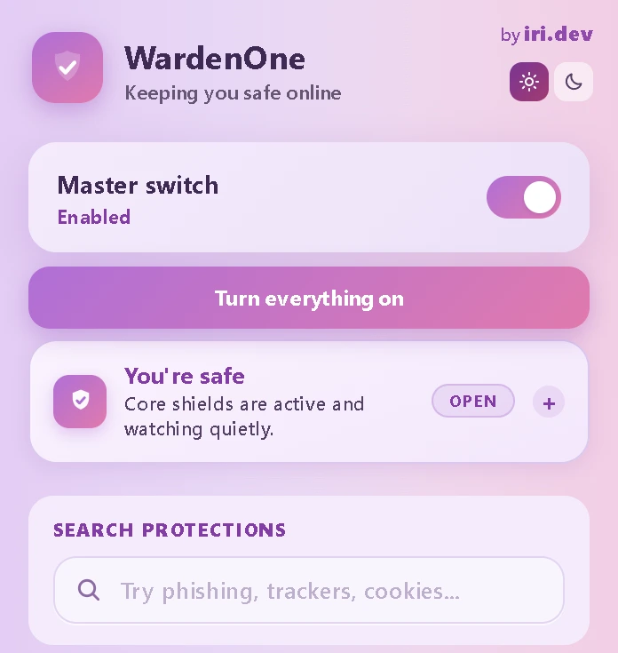
  </a>
</p>
<p align="center"><em>The main popup. Master switch, protection health and a search box for every setting. (Click any image to see it full size.)</em></p>

# Quick install

1. Download [WardenOne-latest.zip](https://github.com/iri-dev/WardenOne/releases/latest/download/WardenOne-latest.zip) and unzip it somewhere you intend to keep it.
2. Open `chrome://extensions` and enable **Developer mode** in the top-right.
3. Select **Load unpacked**, then choose the unzipped folder containing `manifest.json`.

The About page in Settings shows both the version and the GitHub build ID. Include both when
reporting a problem; the version stays the same between rolling builds.

## First run

Pick **Recommended** if you want it to work without breaking sites. **Maximum Privacy** is
stricter. It turns on the extra fingerprinting, first-party tracking, breach, clipboard, referrer
and link protections, so a few sites might act a bit differently. You can change all of it later
anyway.

Then pick **Normal** notifications or **Silent mode**. Silent mode still protects you, it just
hides the routine pop-ups and badges. Everything's still in the Notification Centre if you want
to look.

<p align="center">
  <a href="docs/screenshots/11-onboarding-protection.webp">
    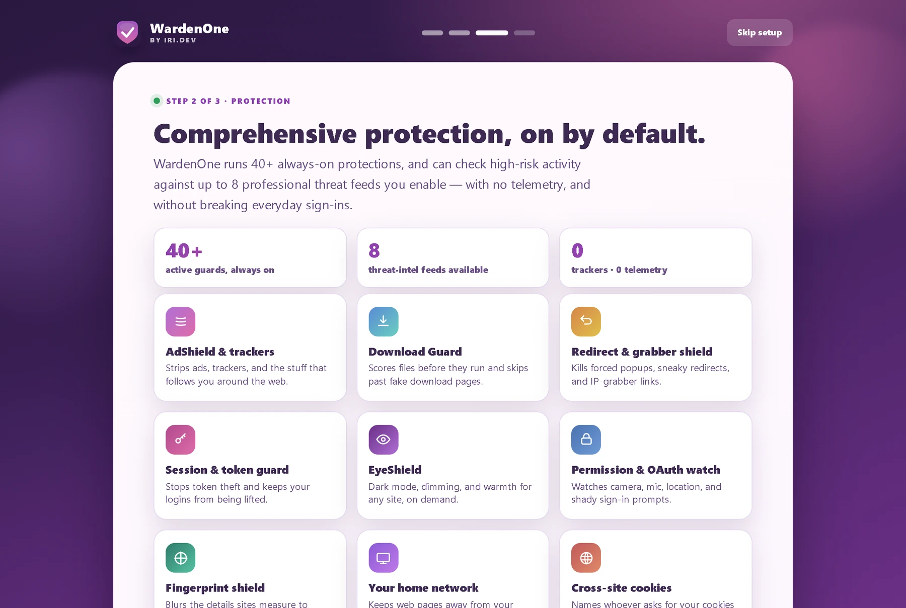
  </a>
</p>
<p align="center"><em>First run. What's switched on and what never leaves your device.</em></p>

<details>
<summary><strong>See the complete first-run journey</strong></summary>

<p align="center">
  <a href="docs/screenshots/11-onboarding-welcome.webp">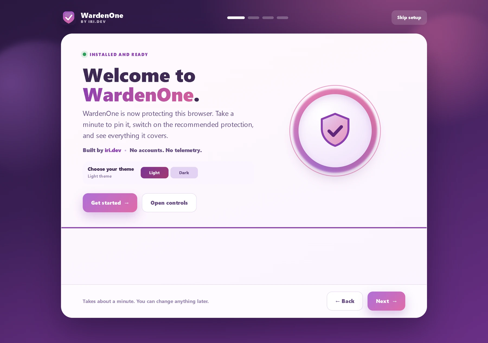</a>
  <a href="docs/screenshots/11-onboarding-explore.webp">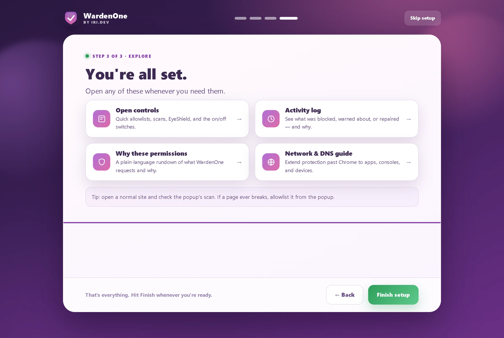</a>
</p>

</details>

<details>
<summary><strong>Updating an unpacked installation</strong></summary>

The ZIP gets rebuilt every time I push something that passes the tests. But an unpacked extension
does **not** update itself from GitHub so you have to do it yourself:

1. Export a settings backup from WardenOne before a major update.
2. Download and unzip the newest build.
3. Keep your installed WardenOne folder at the same path and replace its contents with the new build.
4. Open `chrome://extensions` and press **Reload** on WardenOne.

Keep the folder in the same place. If the path changes Chromium can treat it as a whole different
extension and your settings won't come with it.

</details>

**Compatibility:** Chrome, Brave, Edge, Opera and other Chromium-based browsers.
<sub>Minimum supported Chromium version: 121.</sub>

# Why WardenOne exists

Staying safe online usually means installing an ad blocker and an anti-tracker and a
fingerprinting tool and a pop-up blocker and a download scanner... and then hoping they all get
along. I wanted one extension that just does all of it together. Plus the things content blockers
usually skip, like phishing and password theft protection, checking your other extensions, and
being able to see whether any of it is working.

A few rules I've stuck to while building it:

- If WardenOne finds nothing it says it found nothing. It won't say "safe".
- If something fails (a rule it can't apply, a missing part, a verdict it isn't sure about) you get to see that. It doesn't get quietly ignored.
- If a protection breaks a site you can back off a little at a time. Pause that site, turn off one protection there, undo one firewall rule. You shouldn't have to turn everything off.

## Unknown does not mean safe.

If WardenOne doesn't know, it says it doesn't know.

A file with nothing weird in its structure doesn't get called harmless. An extension that isn't
in the local catalogue doesn't get called trusted. Search results never get a green tick just
because nothing matched. And if a privacy check can't really be measured it says untestable,
not passed.

WardenOne also doesn't promise to be invisible. Some protections have to run inside the page
itself and a page that goes looking can spot them (a few named globals, the warnings it draws,
the events it uses to talk to itself). Renaming them wouldn't make anyone safer. So instead every
single one is written down with the reason it exists, and `tools/test-detectability-budget.js`
fails if a new one sneaks in. A page that finds them doesn't really gain anything either. Anything
from the page that leads to a real decision has to be signed with a key the page never had. And
the protections that really matter run where the page can't reach them.

# Why the name **WardenOne**?

**Warden** is the job. Keep watch over the browser and step in when there's actual evidence
something's wrong, without pretending to know more than it does.

**One** is about how it's built. It's not an ad blocker sat next to a separate phishing tool and a
privacy tool and a download scanner. Everything shares what it knows. A dodgy redirect can feed
into a scam warning. A download can use the reputation of the page it came from. And when a site
breaks you can trace it back through the same activity log that made the decision.

It does **not** mean one extension can stop everything bad on the internet. Nothing can promise
that and I'm not going to pretend this one can.

<p align="center">
  
</p>

# Security

A lot of scams don't look anything like malware. Some steal passwords. Some pretend to be your
browser. Some abuse permissions or redirects or the clipboard. They all work differently so
WardenOne handles them separately.

## Threat Blocklist

Known malware, phishing and scam sites get blocked at the network level before the page even
loads. WardenOne ships with built-in rules and can grab fresh vetted feeds every day. Tens of
thousands of domains are stored locally and the upstream feeds cover millions.

If an update fails the last working copy stays put, so there's no gap. And the update only
downloads a public list file. Nothing about your history or the page you're on goes with it.

## Phishing & Look-Alike Protection

Catches `g00gle`-style swaps, brand names on the wrong domain ending and international characters
that look like a familiar name. It looks at the brand text, password forms, who owns the
site etc all together. Just mentioning a company isn't enough to get a page flagged.

There's also an optional login-page age check. It looks for a password form on a domain that was
registered really recently. When it's on it sends only the domain to RDAP (not the path or the
page or anything you typed) and remembers the answer locally.

**Find it:** WardenOne → Advanced detection.

## Insecure Sign-in Guard

You get a warning when you click into a password box on an unencrypted page. Before you've typed
anything. It also catches the sneakier version where the page is HTTPS but the form sends your
password over plain HTTP anyway. Router logins and other local network stuff is left alone. And if
there's a secure version of the page the warning offers you that instead.

## Browser-in-the-Browser Protection

You click **Sign in with Microsoft**. A Microsoft window pops up with a title bar, an address bar
and a close button. Looks real. Except no window ever opened. The site drew the whole thing inside
its own page, and the password box belongs to the site.

WardenOne warns when it sees all of it together: something shaped like a window, showing a domain
the page doesn't own, with somewhere to type a password. A normal login pop-up isn't treated as
fake just for being a pop-up. Online code editors, design tools and media players are excluded
too.

<details>
<summary><strong>Why it doesn't flag everything that looks like a window</strong></summary>

Looking like a window doesn't mean much by itself. WardenOne checks for fake browser bits (title
bar, address bar, buttons), text naming some other domain, somewhere to enter credentials and
whether the identity it shows matches the real site. It doesn't go off a screenshot or one
CSS class. So a mock browser in someone's docs stays quiet but a fake sign-in window asking for
your password trips a bunch of signals at once.

</details>

## Full-screen Address Guard

In full screen the real address bar disappears. A malicious page can then draw a fake one at the
top and ask for your password, and the one thing that tells you where you actually are is gone.
WardenOne warns when a full-screen page shows a domain it doesn't own next to a password field (or
something similar) and offers to get you out of full screen. Video, games, slideshows and maps are
left alone unless the spoofing signs are there.

## ClickFix & Command Paste Guard

ClickFix scams get you to install the malware yourself. The page tells you to "prove you are
human", then press `Win+R` and paste a command. Or open DevTools and type something it prepared.
WardenOne recognises those instructions and stops the page quietly putting a suspicious command on
your clipboard. It warns you if you copy something dangerous yourself too. And it treats it as
more serious when the instructions and the command turn up together.

It can't read Chrome's own DevTools window. It works on the page and the clipboard writes the page
makes, and steps in before the command leaves the page.

**Where it looks.** Reading the instructions (the fake CAPTCHA wording, the "press Win+R" steps)
runs on the top-level page only. Embedded frames get the clipboard half. If a frame tries to put
a command-shaped string on your clipboard the write gets refused and the same warning shows over
the page, but the frame's text isn't read. Two things aren't checked at all, so no warning means
nothing for those: instructions drawn as an image or on a canvas, and anything inside a
closed shadow tree (no extension can read those). If a scam puts its instructions in a screenshot
WardenOne only stops it if it also tries to copy the command for you.

<p align="center">
  <a href="docs/screenshots/14-clickfix-warning.webp">
    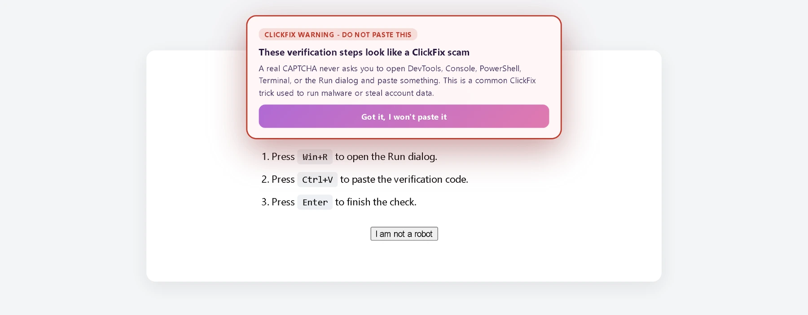
  </a>
</p>
<p align="center"><em>A test page doing the ClickFix trick and the warning WardenOne puts over it. It names the trick instead of just saying "blocked".</em></p>

## Fake Update & Tech-support Scam Protection

Real Chrome or Windows updates don't come from random web pages. Fake Update Detection looks for a
page pretending to be a software company while pushing an installer or a button that sends you off
somewhere else.

Tech-support Scam Guard handles the other classic. "Your computer is infected", a phone number to
call, and a flood of pop-ups meant to lock up your browser. It breaks the lock so you can leave,
and tells you it's the page doing this. Not your computer.

## Notification Scam Protection

Some pages try to talk you into pressing **Allow** on notifications. Fake CAPTCHAs, fake download
steps, made up security warnings, that kind of thing. WardenOne catches it while it's happening.
The wording gets checked locally and thrown away and only the type of event goes into the
Activity Centre. One limit though: a push notification sent later by a service worker happens
outside the page, where this can't see it.

## XSS Behaviour Guard

This watches values coming in from the URL, `window.name`, `postMessage` or the referrer and checks
if they end up somewhere code actually runs. It records where the value came from and where it
went and how serious it looks. Not the value itself.

It's a record of behaviour. It's not a promise that WardenOne finds every cross-site scripting bug
(it won't). Findings that come from the page stay as warnings and can't quietly turn into a
blocking rule.

## Anti-clickjacking

Before a click that matters (signing in, paying, sending money, approving access, installing
something) WardenOne checks whether the thing you're clicking is hidden or covered or not what it
looks like. Normal visible buttons are left alone. It's only there to catch an important click
landing somewhere you can't see.

## Redirect, Pop-up & Back-trap Protection

Forced pop-ups and pop-unders. Ad tabs that open on a timer. Redirects you never clicked, CPA
chains, meta-refresh bounces, download pages hidden behind ads, fake confirm boxes, frames that
steal your click and send it somewhere else. They're all related but each one gets handled on its
own.

You can remove overlays on the page and there's an Undo chip if you change your mind. It tries to
leave real payment forms, CAPTCHAs, logins and media controls alone. If WardenOne stops a jump
right after a real click you get its warning page with a Continue button. Only the guard that
stopped the jump can open that page, so a script on the site can't sneak its own destination in
behind it.

Back-button protection stops pages that keep re-adding themselves to your history or stacking up
entries or shoving you forward again. It never deletes your history or navigates for you. History
changes right after a normal click or keypress are trusted (that's what keeps galleries and
single-page apps working).

<details>
<summary><strong>Why bounce cleanup is so careful</strong></summary>

When a tracker sits in a redirect between the site you left and the one you land on, it briefly
counts as first party. That gives it a moment to store things that third-party cookie blocking
can't touch. WardenOne already knows the redirect chain so it can clean up what a known tracker
left behind.

I'm deliberately careful here. It only clears a hop if you actually passed through it, it's
already on a blocking list, and it doesn't look like part of a login or payment. The page you asked
for, the page you ended up on and anything ambiguous are left alone. Missing a tracker is fine.
Breaking someone's sign-in halfway through isn't.

</details>

<p align="center">
  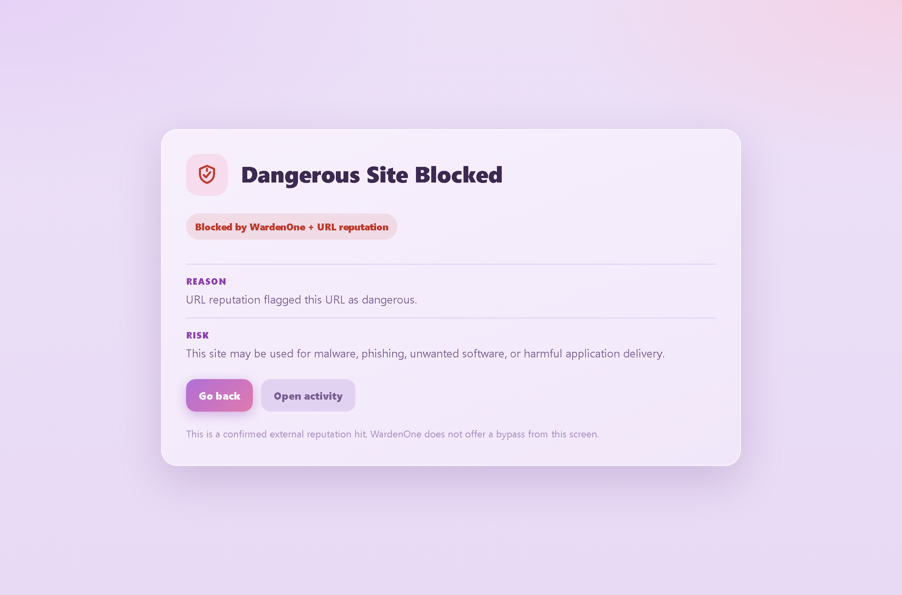
</p>
<p align="center"><em>When WardenOne stops a page it tells you why.</em></p>

## SessionShield

<sub><strong>PROTECTION SUITE · LOGIN & SESSION SECURITY</strong></sub>

**What it does:** protects everything that matters once you're logged in. Session tokens, cookies,
password and card fields, OAuth grants, the clipboard, anywhere a site keeps your identity. It
never records or shows a full token, password or card number.

Each part has its own switch. Protecting a token and spotting a card skimmer and warning about a
risky paste are different jobs and they can each break different sites.

**Find it:** WardenOne → SessionShield — login & session protection.

### Session Token Guard

SessionShield looks for token-like values sitting in URLs, cookies and any storage scripts can
read. It keeps watching after you log in, not just on page load. Token Guard then checks the
page's request APIs (and its frames) for those exact values and blocks a call it sees sending one
to an unrelated domain.

Hostile page code can get around those page-level hooks. The browser's network rules are separate
though and still block the destinations they cover.

Services that are known to be noisy get logged more quietly, without weakening anything. And the
token itself never gets copied into the Activity Centre. Not even to explain what was caught.

### Form Skimmer & Magecart Guard

A third-party script reading your password or card fields is suspicious. That value then getting
sent off to another site is a lot more suspicious. WardenOne watches for both and can block
matching requests, including forms and requests inside embedded frames (which is where loads of
hosted payment fields live).

It follows where the value actually goes. It doesn't treat every third-party script on a checkout
page as malware, because real payment processors and sign-in providers need to read their own
fields.

### Payment Card Guard

Warns you before your card details go to a checkout that looks like a scam, is really new or has a
bad reputation. Forms that are insecure, on a look-alike domain, on a raw IP or known to be
dangerous get blocked from submitting.

Embedded frames get a lighter check that only watches for card details being sent away. The full
checks run on the top page because that's where the site's identity actually means something.

### Autofill Trap Guard

A page can hide username or password fields where you can't see them and wait for your browser or
password manager to fill them in. WardenOne looks for credential fields that got autofilled when
there's no visible login form to explain them. A normal login that fills its visible fields plus a
hidden helper field won't set it off. It needs both. Hidden fields getting filled and no visible
login.

### Paste Protection

Warns you before you paste a password, API token, private key or seed phrase into an insecure
page, a look-alike domain or a form that sends it somewhere else. Normal secure logins don't
trigger it.

### Clipboard Hijack Protection

Stops a site from quietly replacing what you copied. Like swapping a crypto address for the
attacker's.

### Clipboard Swap Detection

A second check when you paste. If the address you copied and the one you're pasting are the same
currency but don't match, it shows you both so you can compare. That can even catch malware doing
the swap outside the browser. Neither address gets sent anywhere.

### OAuth Grant Guard

A Google, Microsoft, GitHub or Discord consent page can hand over way more than a simple sign-in.
WardenOne warns when an app asks for your mail, contacts, repos, admin rights or long-lived offline
access, or when the redirect looks off. It doesn't block OAuth just because of the brand. It looks
at what's being asked for and where it's going.

### Honeytoken Mode

Experimental. It plants fake secret names in the page (only ones the site isn't already using).
Normal site code has no reason to know they exist so a script that reads one is probably hunting
for credentials. If the page turns out to have a real property with the same name the decoy
gets out of the way.

### Keystroke Pressure Detection

Warns when a page attaches a really large number of global key listeners. Rich text editors and
chat apps can do that legitimately too, so it's noisy and it's off by default. It's not a reliable
keylogger detector and I'm not going to pretend it is.

### Breach & Password Checks

The site history tool can ask Have I Been Pwned if a domain shows up in public breach records. The
password check is separate. It hashes your password locally, sends only the first five characters
of the hash and gets back a big list of possible matches to compare against. WardenOne doesn't
read passwords from website fields, doesn't save the answer and never sends the password or the
full hash.

Both are optional and obviously both leave your device. They only run when you ask.

### Session Security Grade

The current site gets an A–F grade based on its connection, exposed JWTs, how it stores tokens and
its cookie settings. It's something to look into. It's not a guarantee your account can't be
compromised.

### Emergency Logout

If you think an account's already been compromised, Emergency Logout clears the cookies and
session data for this site or signs you out everywhere. In one go. It's kept separate from the
normal privacy cleaning because it's for emergencies, not tidying up.

<p align="center">
  <a href="docs/screenshots/12-session-shield.webp">
    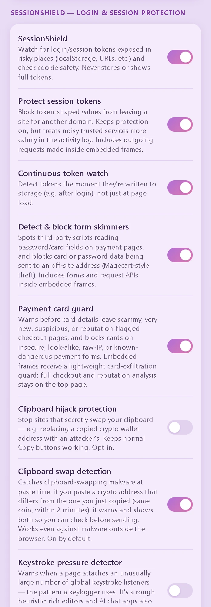
  </a>
</p>
<p align="center"><em>Each protection above has its own switch.</em></p>

## Download Shield

<sub><strong>AUTOMATIC PROTECTION · DOWNLOAD CONTEXT & REPUTATION</strong></sub>

**What it does:** grades your downloads before they finish, based on where they came from and what they say they are.

Download Shield and File Shield sound alike but they look at different things. Download Shield
knows how a file got to you. File Shield knows what's actually inside it. You kind of need both,
neither one can do the other's job.

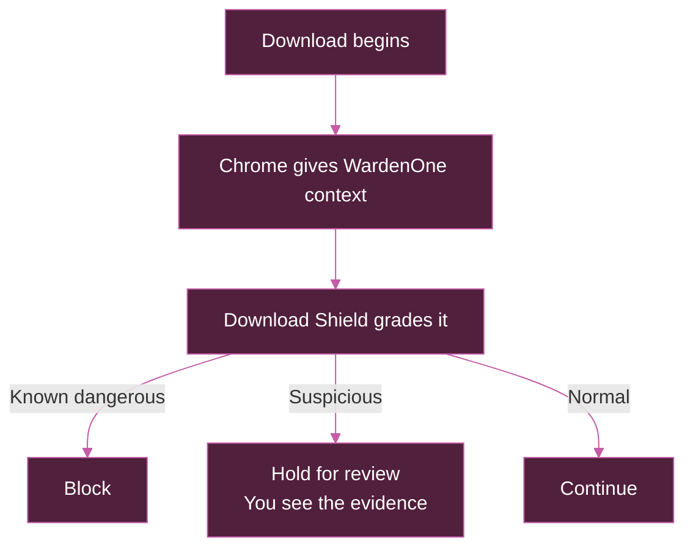
```mermaid
flowchart TB
    Start["Download begins"] --> Context["Chrome gives WardenOne context"]
    Context --> Grade["Download Shield grades it"]
    Grade -->|Known dangerous| Block["Block"]
    Grade -->|Suspicious| Review["Hold for review<br/>You see the evidence"]
    Grade -->|Normal| Continue["Continue"]
    classDef warden fill:#51203c,stroke:#c45ca7,color:#ffffff
    class Start,Context,Grade,Block,Review,Continue warden
    linkStyle default stroke:#c45ca7
```

| | Download Shield | File Shield |
| --- | --- | --- |
| **Question** | Should this browser download finish? | What is actually inside this local file? |
| **Evidence** | Source page, URL, name, type, browser signals, lists and optional reputation | Real bytes, format, structures, scripts, archives, documents and hashes |
| **Access** | Automatic for downloads Chrome reports | Only after you explicitly choose or drop a file |
| **Boundary** | Cannot freely read the saved file | Cannot observe how the file originally arrived |

**When a download starts**

1. Chrome hands WardenOne the page it came from, the URL, the filename and type, plus whatever Chrome itself thinks of it.
2. WardenOne grades it using that plus publisher trust, local lists and any optional services you turned on.
3. Known dangerous downloads get blocked. Risky ones get held so you can look. Normal ones carry on.
4. If it's held, the Download Review page explains the A–F grade and you decide whether to cancel it or let it finish (when finishing is allowed for that grade).

Clean downloads straight from a publisher's own installer host can go through quietly. Big shared
cloud and CDN hosts don't get trusted just for being big. A disguised file or a known-malware hash
beats a legit-looking publisher every time.

If you want more you can turn on extra lookups too: domain age, Google Safe Browsing, VirusTotal,
URLhaus, AbuseIPDB, OpenPhish, PhishTank, WhoisXML. They're all optional and each one tells you
exactly what it sends. There's no hidden WardenOne reputation server behind any of it.

<p align="center">
  <a href="docs/screenshots/04-download-review-suspicious.webp">
    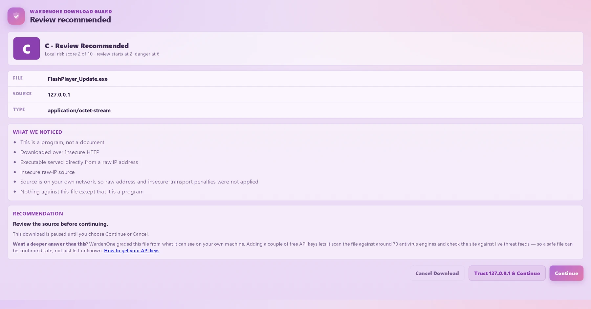
  </a>
</p>
<p align="center"><em>A test download that's suspicious on purpose, paused with the evidence. Your call.</em></p>

<details>
<summary><strong>See the Download Shield controls</strong></summary>

<p align="center">
  <a href="docs/screenshots/04-download-shield.webp">
    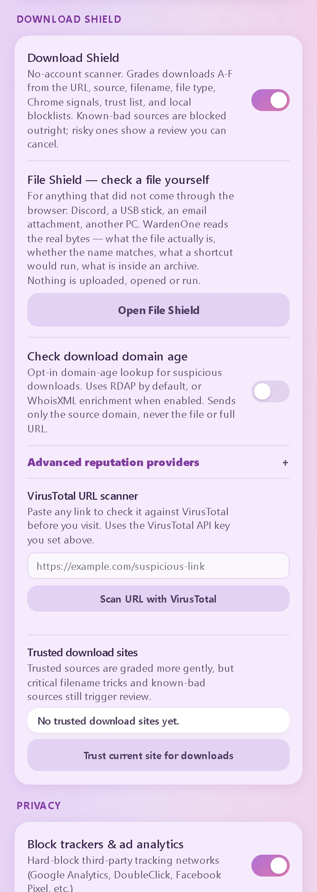
  </a>
</p>

</details>

**Find it:** WardenOne → Download Shield.

## File Shield

<sub><strong>LOCAL TOOL · FILE STRUCTURE & HASH ANALYSIS</strong></sub>

**What it does:** looks at the real bytes of a file you pick. It doesn't open it, run it or upload it.

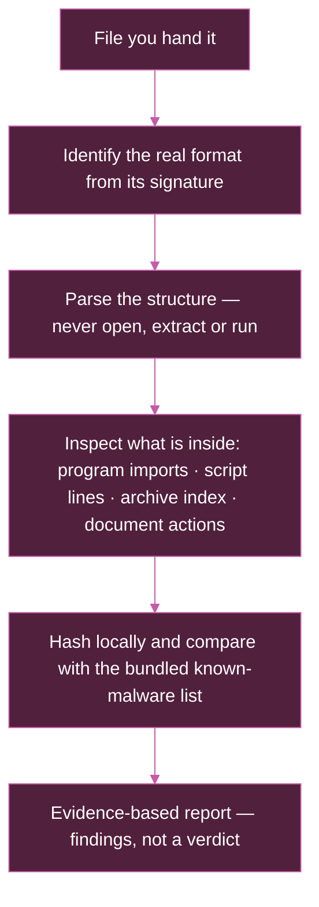
```mermaid
flowchart TB
    Pick["File you hand it"] --> Format["Identify the real format from its signature"]
    Format --> Parse["Parse the structure — never open, extract or run"]
    Parse --> Inspect["Inspect what is inside: program imports · script lines · archive index · document actions"]
    Inspect --> Hash["Hash locally and compare with the bundled known-malware list"]
    Hash --> Report["Evidence-based report — findings, not a verdict"]
    classDef warden fill:#51203c,stroke:#c45ca7,color:#ffffff
    class Pick,Format,Parse,Inspect,Hash,Report warden
    linkStyle default stroke:#c45ca7
```

Chrome doesn't let extensions read your saved files. And downloading it again from the same
link isn't reliable, because signed or personalised or one-time links can give back different
bytes. So File Shield only reads the actual file you hand it. Nothing gets uploaded, opened,
extracted or run.

**What File Shield reads**

- **Real format.** The file's signature gives away a Windows program renamed to `holiday-photo.jpg`. Same for double extensions, right-to-left override characters and padded names.
- **Windows programs.** Signatures and signer names, imported capabilities, packing, signs of networking, launching processes, installing services or injecting into other processes.
- **Scripts.** Batch, PowerShell, VBScript, JavaScript and HTA shown as written, with the lines that download, decode, persist, turn off protection or delete backups pointed out.
- **Shortcuts.** The actual command a Windows `.lnk` file would run when you double-click it.
- **Archives.** The index gets checked without extracting anything. Executables, path traversal, encryption, nesting, macros, files that claim they'll expand to something enormous.
- **Documents.** Office macros and PDF actions that can run scripts, launch programs or carry embedded files.
- **SHA-256.** Checked locally against the known-malware hashes that ship with WardenOne. A match means those exact bytes are known.
- **Optional VirusTotal lookup.** There's a button for this, but it only sends the SHA-256 (with your own API key) and only when you press it. The file and its name never leave your computer.

You can drop a bunch of files or a whole folder at once, and copy the report to send back to
whoever gave you the file.

**It never says "safe"**

File Shield reads how a file is put together, not what it'll do once it's running. So it can tell
you a file's disguised, or has code inside, or uses something dangerous, or matches a known bad
hash. What it can't do is prove a file is harmless, and it won't ever pretend to. A clean result
means **the checks that ran found nothing disguised**. That's it.

And it's not antivirus. No watching your files in the background, no sandbox, no quarantine. Keep
using whatever you already have to protect your PC.

<p align="center">
  <a href="docs/screenshots/05-file-shield-after-scan.webp">
    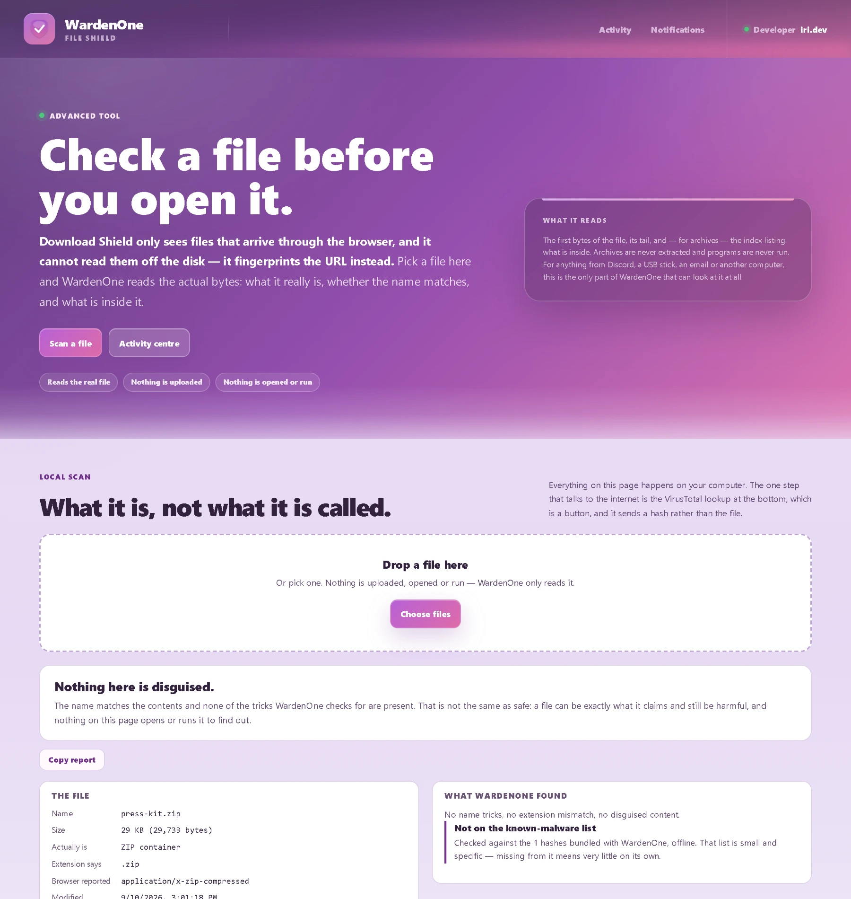
  </a>
</p>
<p align="center"><em>What the bytes show. "Nothing disguised" never turns into "safe".</em></p>

<details>
<summary><strong>See File Shield before a file is chosen</strong></summary>

<p align="center">
  <a href="docs/screenshots/05-file-shield-before.webp">
    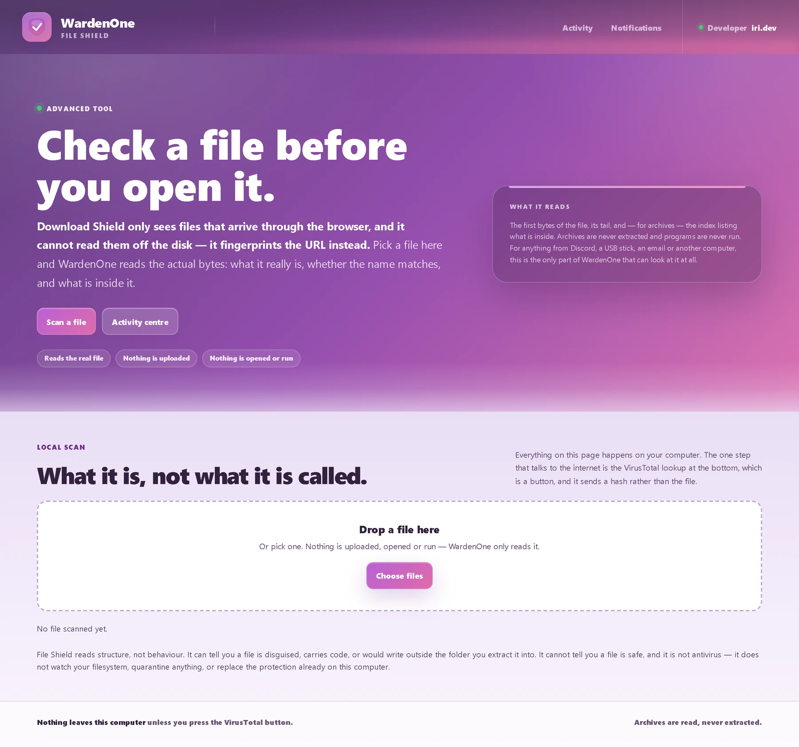
  </a>
</p>

</details>

**Find it:** WardenOne → Download Shield → Open File Shield.

## Network and device defence

<sub><strong>PROTECTION SUITE · IP, PRIVATE NETWORK & DEVICE ACCESS</strong></sub>

**What it does:** covers the bits of the browser that go beyond the page you can see. Sites can ask
about your local addresses, try to reach devices on your home network, open your camera or mic,
reuse old permissions and leave stuff running in the background.

### WebRTC & IP-logger Protection

WebRTC can leak your local network addresses without a normal page request. WardenOne blocks known
IP-grabber beacons and logger hosts (Grabify-style links etc). The guard has two levels and each
one has its own switch.

**IP lookup blocking** (on by default) blocks the common third-party "what is my IP" services, so a
page can't ask an outside service for your address. It leaves WebRTC itself alone.

**Harden WebRTC** (off by default) strips the ICE servers from peer connections and refuses ones
created without a recent click. That's what actually stops WebRTC handing out your local and
public addresses. It's also what breaks video calls, screen sharing and some streaming. Which is
why it's a separate choice.

The Privacy Self-Test checks for local address candidates without contacting a STUN server. The
local leak is the useful thing to measure and it doesn't need an outside service to show it.

### HTTPS & Certificate Protection

Force HTTPS upgrades pages and requests to HTTPS wherever it can. If a certificate fails you get a
proper WardenOne warning page instead of a confusing broken one. Local network addresses are
handled separately because routers and dev boxes often skip HTTPS on purpose.

### Intranet Guard

A public website has no business poking at your router, NAS, printer, dev server or any other
private admin page. Intranet Guard checks the requests a page makes. Its network rules also block
direct private-network targets from pages and workers, including IP addresses and local names like
`router.local`. Keep the network rules on. They're the part the browser itself enforces.

Pages you opened from your own network can still reach it though. What matters is who started it.
A local tool talking to your own devices is normal. Some random public page scanning the same
addresses isn't.

### DNS Rebinding Protection

A hostname can look public and then switch to a private address once a request's already going.
WardenOne watches which addresses sites really resolve to. If a public name points at your local
network or flips from public to private (that's the giveaway for a rebinding attack) it gets
blocked for the rest of the session.

Chromium doesn't give extensions a reliable DNS answer before a request goes out, so by the time
the trick shows up that first request has already happened. Direct private-network access is
blocked outright. Rebinding is caught from that first lookup onwards. WardenOne doesn't claim to
block that very first request because the browser doesn't show the evidence early enough to
honestly say so.

### Media Shield

Media Shield can refuse camera, microphone, screen capture and hidden background media. For the
camera and mic what matters is whether you're actually there, not which site it is. If a site asks
while you're using the page (you clicked or pressed a key in the last few seconds) it goes to
Chrome's normal prompt. And a site you've already allowed in Chrome isn't second-guessed. If it
asks while nobody's at the page it's refused, unless Chrome already has a permission on file for
it.

Screen capture is never pre-approved. After a click Chrome's own picker decides, every time. The
mic protection covers speech recognition too, which gets to your audio a different way (a
`getUserMedia`-only guard would miss it) and which Chrome might send off for transcription. Same
rule applies. When WardenOne refuses it uses the browser's normal "permission denied" path, so a
site that copes with you pressing **Block** copes with WardenOne too.

### Location Guard

Location blocking has its own switch, so you can refuse your location without touching the rest of
the device and permission settings. The block lives in Chrome's own location setting. If you pause
WardenOne on a site or turn the block off for just that site, the site goes back to Chrome's normal
location prompt. Never straight to automatic access. And that exception ends when the pause does.
Turning the block off completely removes every location rule WardenOne wrote and leaves Chrome's
default (and your own per-site choices) the way they were.

### Permission Chain Guard

Looks at permission prompts together instead of one at a time. A notification request followed by
camera, clipboard, location, screen sharing or file access can be riskier as a sequence than any of
them on their own.

### Site Permission Scanner

Shows what the current site is allowed to use and lets you set camera, mic, notifications and
location to allow, block or ask. Chrome is still the one that applies it.

### Watch-only Protections

<sub><strong>WATCH-ONLY · LOCAL EVIDENCE, NO PAGE MODIFICATION</strong></sub>

Some things are worth knowing about but not worth blocking. These three only write an entry in the
local Activity Centre. Where a permission decision is needed Chrome already asks you anyway.

<details>
<summary><strong>Exactly what gets recorded, and what doesn't</strong></summary>

- **Background reports.** Where a beacon got sent, noted once per page. What it carried is never read or stored.
- **Hardware and file access.** USB, serial, HID, Bluetooth, MIDI, XR, NFC, game controllers, files and folders. Including a site reusing access you gave it before. WardenOne stores what kind of access it was. Never the device, the path you picked, the file, the folder or the controller model.
- **Browser capabilities.** Service workers being registered, web apps being installed, idle detection and Chrome's payment sheet. The payment method can be named but never the amount or the item.

XR is there because an immersive session can expose your movements constantly (and with AR, details
about the room it maps). NFC writes are there because they change a physical tag and can sometimes
lock it read-only for good. Game controllers aren't suspicious at all. The model name is just a
fingerprinting thing, so WardenOne records how many there are and never the model.

One limit. Watching from the top page can't see every API call inside every frame. Cross-origin
frames still need the page's permission policy to use these, but a same-origin frame can share
more of the page's access.

</details>

<p align="center">
  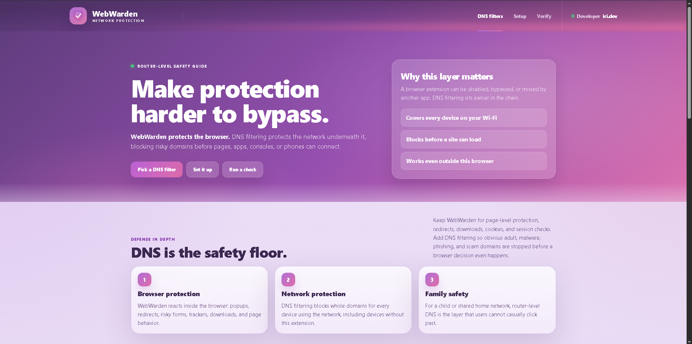
</p>
<p align="center"><em>WardenOne only protects this browser. The guide explains how DNS filtering can cover your other devices too.</em></p>

## Extension Security Centre

<sub><strong>INTERFACE · INSTALLED EXTENSION IDENTITY & CHANGE HISTORY</strong></sub>

**What it does:** shows what every installed extension is, what it can access and what changed.

Extensions can change after you install them. An update can add new permissions. Two extensions
can have really similar names and completely different IDs. So WardenOne tracks all of that
separately.

The Extension Security Centre lists every extension you've got installed. Exact ID, version,
whether it's on, how it got installed, Chrome's permission warnings, and what its permissions add
up to. It checks the exact IDs against an incident and identity catalogue that ships with
WardenOne, so your extension list never gets uploaded anywhere.

Once you've reviewed an extension a plain version update doesn't undo that. A change to its
permissions, identity, install source or reputation does reopen it though, and version changes
still show up in the history. Broad access gets explained, not automatically called malicious. An
unknown ID never gets called safe. There's buttons to disable an extension or ask Chrome to remove
it (Chrome asks you to confirm). WardenOne never removes anything on its own.

<p align="center">
  <a href="docs/screenshots/06-extension-centre.webp">
    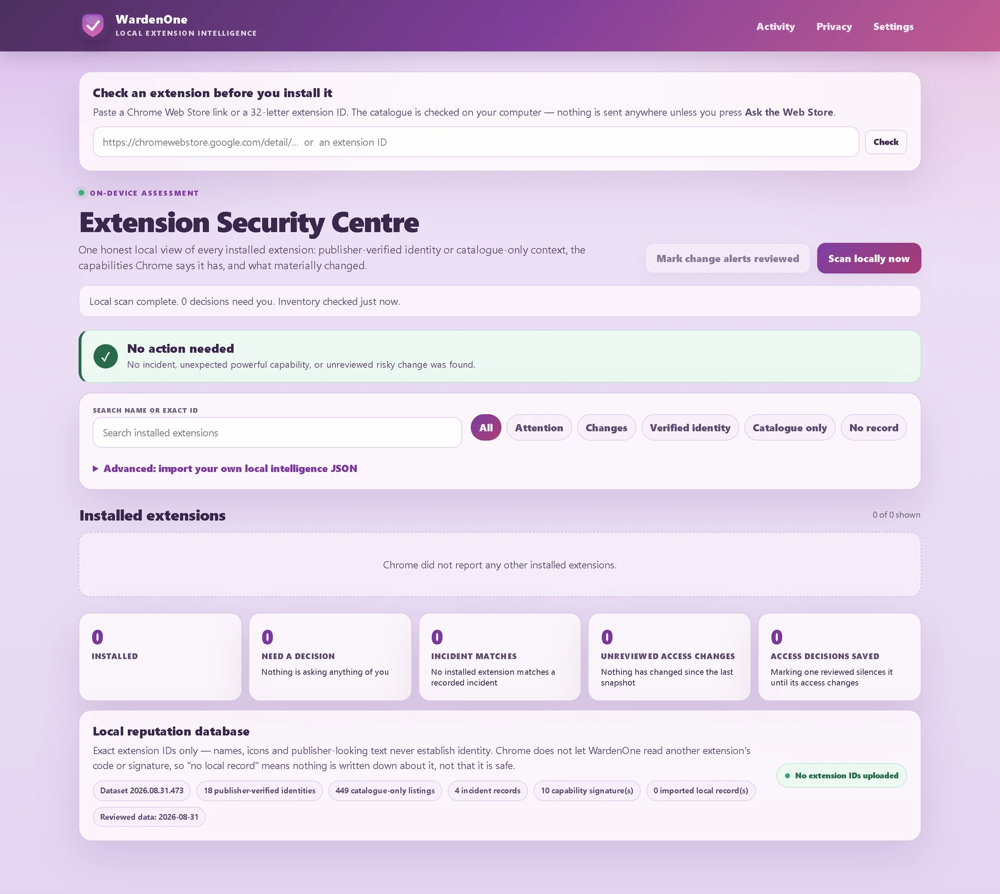
  </a>
</p>
<p align="center"><em>Everything on one page. What changed, and what the local catalogue knows about each one.</em></p>

### Extension Change Monitoring

Keeps a local timeline of each extension's versions, permissions and on/off state. Normal updates
still show up. New powerful access gets highlighted so you can take a look.

### Startup Security Check

When the browser starts this scans your restored tabs and catches up on the extension list.
Without losing any change that happened while WardenOne's background worker was asleep.

### Pre-install Extension Check

Paste a Chrome Web Store link or a 32-character ID to check an extension before you install it.
You don't have to install it at all. The exact ID gets checked against the same catalogue the
Security Centre uses, and a known incident stays attached to an ID even if the extension gets
renamed.

There's a separate optional button that asks the Web Store what name is currently published under
that ID. It's separate because it tells Google which extension you're looking at. WardenOne only
sends the ID. No cookies, no Web Store session.

If there's no listing it says **removed or never existed**, because from the outside those look
exactly the same. If the catalogue has no record it says **unexamined**, not cleared. Chrome
doesn't let one extension see another extension's code or permissions before it's installed, so
this is checking identity and the listing. It's not a code review.

<details>
<summary><strong>See an example of checking an extension before installation</strong></summary>

<p align="center">
  <a href="docs/screenshots/06-extension-check-result.webp">
    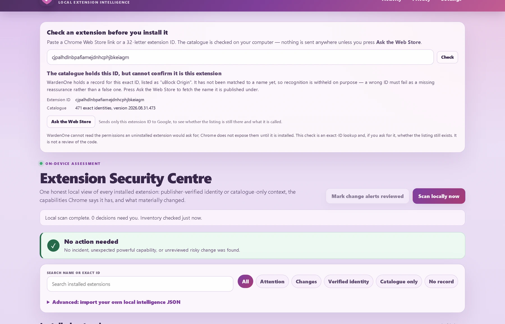
  </a>
</p>
<p align="center"><em>An exact ID match is useful. WardenOne just doesn't stretch it into more than that.</em></p>

</details>

### Update Guardian

When you open the popup Update Guardian checks the latest public Stable release of Brave, Chrome or
Edge and shows a simple update status. It only tells you to update when it can tell
there's a newer release. Brave can hide its exact version from extensions, and a matching Chrome
or Edge major version doesn't tell you the patch level. So in those cases it shows the latest
release and sends you to the browser's own update page to check.

For Chrome it only counts releases every Stable user can get, so a staged rollout that hasn't
reached you yet doesn't count as a missed update. Results get reused for up to six hours while the
browser's open. Restart or hit the refresh icon to check again. It sends no browsing history or
page address. The [sources and comparison limits](docs/update-guardian-release-baseline.md) are
written up separately if you want them.

<p align="center">
  
</p>

# Privacy & anti-tracking

Privacy protection can't just be one blocklist. Trackers live on third-party hosts, sure. But they
also hide behind a site's own domain, leave storage behind during redirects, ride along in email
images, fingerprint you without sending a single request, or tag links that other people open
later.

## Tracker protection

Known analytics and tracking services get blocked using built-in EasyPrivacy-style rules and fresh
feeds. WardenOne can send the Do Not Track and Global Privacy Control signals too. Domains that only
exist to track get treated more strictly than normal cross-site services, since there's no login
or checkout on them to protect.

All the filtering happens on your device. WardenOne never sends your browsing to a server to ask if
a request is OK.

## First-party Tracker Protection

Analytics can be routed through the site's own domain, where a list of third-party hostnames can't
see it. WardenOne detects those first-party routes. It also has a local tracker learner that builds
up evidence on your device over time.

The learner only ever **suggests**. When a third-party domain has acted like a tracker on three of
your sites across two browser sessions it shows up in the popup under *Trackers noticed across your
sites*. Nothing gets blocked until you press **Block**. Everything the learner sees comes from web
pages, so a page could make it suggest a block but never actually make one.

None of this turns into a crowdsourced record of your browsing. Or a local one. The learner keeps
counts (sites, sessions, requests) and a keyed sketch that can only answer "have I counted this site
already?". It never stores the names of the sites a tracker was seen on, and its observations expire
after 30 days. Which trackers the current site used is only shown for this browser session.

## Cookie and storage controls

On top of blocking third-party cookies WardenOne can wipe cookies when you close the browser, or
stop them sticking around at all. It's careful around embedded frames and scripts in general
because sign-ins depend on them. Domains that only exist for measurement get handled more strictly
though.

When an embedded frame uses the Storage Access API to ask for its cookies you can see who's asking.
Known trackers get refused. Requests that are invisible or happen without you doing anything get
flagged. There's a separate opt-in that blocks every cross-site storage request. I left that out of
both Recommended and Maximum Privacy on purpose because it will break some embedded logins and
checkouts.

## Link hygiene

When you copy a link the known tracking parameters and redirect wrappers get stripped off.
Hyperlink-auditing `ping` attributes are removed before they can report your click. WardenOne also
catches tracking parameters a page sticks straight into the address bar with `history.pushState` or
`replaceState`. There's no click and no navigation there for a normal link cleaner to notice.
Link-click pings and the address cleaner have separate switches in the popup, and neither one
changes where a normal link or form goes.

**Before**

```text
https://example.com/article?utm_source=email&utm_campaign=sale&id=42
```

**After**

```text
https://example.com/article?id=42
```

Only recognised tracking values get removed. Unknown parameters, paths and fragments stay exactly
as they were. The site-specific rules used when you copy a link aren't applied to the live address
bar either, because things like Amazon's search state or Spotify's context can be part of how the
site works.

## Bounce-tracking Cleanup

If a redirect took you through a known tracker domain, that domain's first-party cookies and
storage can be cleared once the redirect finishes. The page you asked for, the page you ended up
on, login and payment steps and anything ambiguous are always left out.

## Service-worker Cleanup

Opt-in. Notes which sites install service workers and can remove one after you close that site's
last tab. It's off by default because service workers also do useful things like offline reading
and notifications. Removing one means those stop until you visit again.

## Header Shield

Cuts down the Client Hints sent to third parties, can remove cross-site referrers, and has ETag
protection for known tracking services only. First-party, sign-in, CAPTCHA and payment requests
are left alone. Rewriting every header everywhere would look impressive and break a ton of sites.
So I kept it narrow.

## Consent protection

Cookie banners come in a few different shapes and one action doesn't fit them all:

- If there's a real **Reject** option WardenOne opens the choices if it has to, turns off the optional tracking and never clicks Accept.
- If it's a consent-or-pay wall with no way to say no, and the article's already there underneath, an opt-in can lift the wall without clicking anything or saving a consent cookie. If the article never actually loaded WardenOne puts the wall back. Better than a blank page.
- If you accepted tracking yourself, the consent and tracking cookies can get cleared after you leave and you stay signed in.

Login compatibility stays on by default. A sign-in hand-off can look like a redirect. A request to
an identity provider can look like data being stolen. A login pop-up can look like an overlay. So
those flows are excluded by how they work, not patched one site at a time.

## Mail Shield

Marketing emails hide a one-pixel image with an ID for you in its URL. When it loads the sender
finds out you opened the email, when, and roughly where you were. Normal network blocking can miss
this in Gmail. Gmail loads remote images through `googleusercontent.com`, so the tracker's hostname
is gone by the time the request goes out.

But it's not always gone for good. Gmail sometimes keeps the original address in the fragment (the
bit after `#`) of the proxy link it puts in the page. Fragments never get sent to a server, which is
exactly why a blocklist can't see it and why Mail Shield works inside the webmail page instead.
Where the original address is still there it reads it and swaps the likely pixel for a transparent
image of the same declared size.

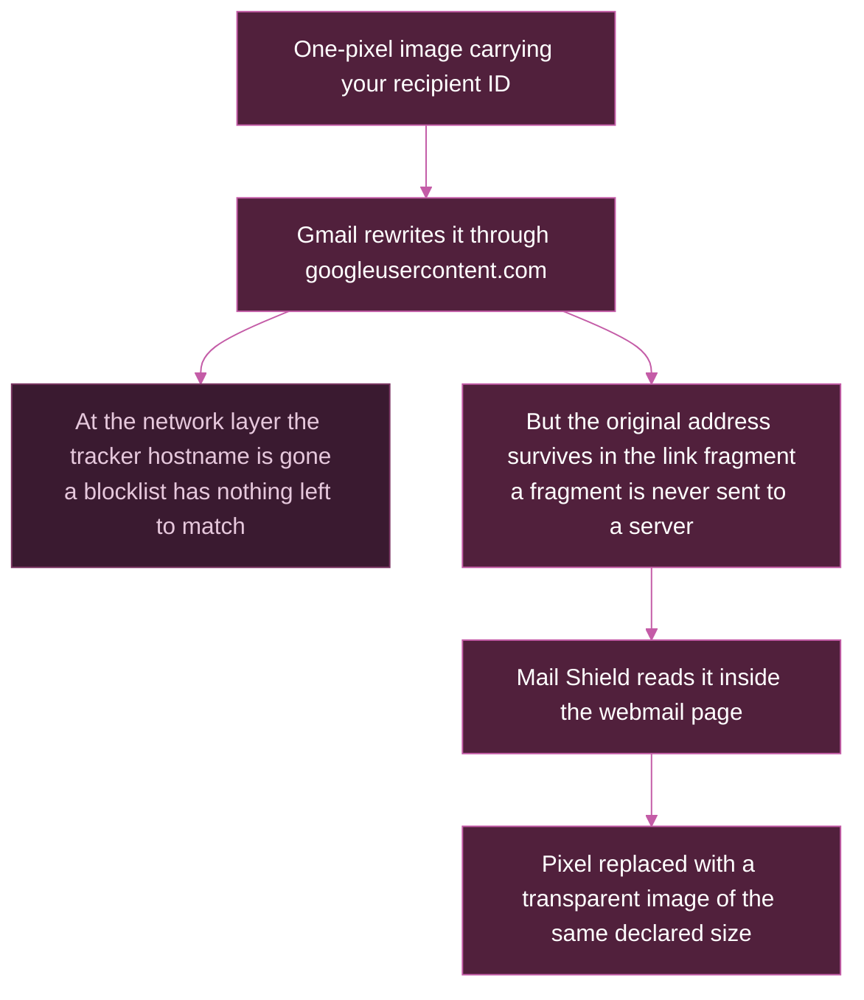
```mermaid
flowchart TB
    Pixel["One-pixel image carrying your recipient ID"] --> Proxy["Gmail rewrites it through googleusercontent.com"]
    Proxy --> Blind["At the network layer the tracker hostname is gone<br/>a blocklist has nothing left to match"]
    Proxy --> Kept["But the original address survives in the link fragment<br/>a fragment is never sent to a server"]
    Kept --> Recover["Mail Shield reads it inside the webmail page"]
    Recover --> Neutralise["Pixel replaced with a transparent image of the same declared size"]
    classDef warden fill:#51203c,stroke:#c45ca7,color:#ffffff
    classDef dead fill:#3a1a30,stroke:#7a3562,color:#e6c8dc
    class Pixel,Proxy,Kept,Recover,Neutralise warden
    class Blind dead
    linkStyle default stroke:#c45ca7
```

Mail Shield only runs on Gmail, Outlook, Proton, Yahoo, Fastmail, Zoho, AOL and Gandi. It doesn't
look at images anywhere else. Everything happens inside the webmail page. No email content or pixel
address ever gets sent anywhere.

<details>
<summary><strong>How it decides in time, and where it falls short</strong></summary>

It decides from the email's HTML, not how big the image renders, because by the time an image has
a size it might already have loaded. Deferred `data-src` addresses are covered too. It swaps a
suspected pixel for a transparent one rather than removing it because older HTML emails still use
tiny spacer images for layout.

A pixel that hasn't loaded yet can be stopped before anything goes out. One that's already loading
can be cancelled but some of it might've reached the network already. If a provider strips every
trace of the original address there's only the image's shape left to go on. And whether the
provider fetched the image on its own servers is something no browser extension can see. Mail
Shield doesn't claim to stop all email tracking.

</details>

## Anti-fingerprinting

This one's opt-in. It covers canvas text measurements, audio, WebGL, WebGPU, fonts, monitor layout,
keyboard layout, voices and similar things sites measure. Either with per-session noise or with
fixed answers everyone using the protection shares.

Being consistent matters more than being random. If a page got different GPU answers to the same
question that'd be rarer than your real machine. Which makes it an even better fingerprint. So
WebGL and WebGPU get one GPU identity across the page and its frames. It's picked per site and
stays the same across reloads, tabs and the site's frames. Two different sites get unrelated ones.
WebGPU limits get lowered to the spec minimums everyone with the protection shares. Canvas and
audio noise still change every load. Core count and memory are left alone because a worker can
show their real values anyway.

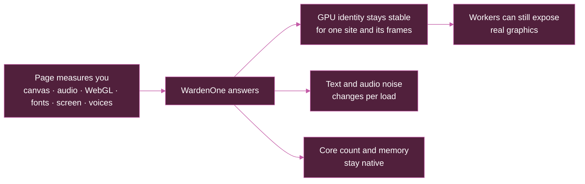
```mermaid
flowchart LR
    Ask["Page measures you<br/>canvas · audio · WebGL · fonts · screen · voices"] --> Shield["WardenOne answers"]
    Shield --> Stable["GPU identity stays stable<br/>for one site and its frames"]
    Shield --> Noise["Text and audio noise<br/>changes per load"]
    Shield --> Native["Core count and memory<br/>stay native"]
    Stable --> Limit["Workers can still expose<br/>real graphics"]
    classDef warden fill:#51203c,stroke:#c45ca7,color:#ffffff
    class Ask,Shield,Stable,Noise,Native,Limit warden
    linkStyle default stroke:#c45ca7
```

Media capability checks keep the browser's real `supported` answer, because lying about that can
break video. They do hide whether a supported codec is smooth or power-efficient though, since that
gives away roughly how new your GPU is. WebCodecs support is watched, not changed. And a burst of
capability probes gets logged separately from the shield, so noticing fingerprinting and changing
the answers stay two different things.

**Where it runs.** The noise changes the JavaScript environment it runs in (the realm), and a page
has more than one. Every frame it embeds gets a fresh one. So the same noise runs in every frame as
well as the page. Same-origin frames (`about:blank`, `srcdoc`, an `about:blank` window the page
opens) pick up the page's settings and seed the moment they're created, before the page can borrow
anything from them. That way a hidden frame's canvas gives the same answer as the page. Cross-origin
frames follow the same switch, the same pause and the same per-site choices as the page around
them. Captcha frames are left alone, same as the sign-in and captcha hosts the shield already
skips.

Web workers aren't covered. An extension can't get inside a worker's realm without re-serving the
worker's code, and that breaks module workers and scripts that load files relative to their own
location. So an `OffscreenCanvas` inside a worker still answers with your real machine. The page's
core count and memory stay native so the page and its workers don't disagree on those. Worker
graphics can still differ from the page's protected graphics though, so this can't guarantee every
realm gives the same answer.

<details>
<summary><strong>Why anti-fingerprinting is opt-in</strong></summary>

Some of this can't be changed without breaking something. If your powerful machine says it isn't
power-efficient a site might give you a lower quality video. Blocking font or display listing can
mess with design tools and video calls. So these stay as choices you can see, the answers stay
consistent for the session, and I'm not going to claim more noise is always more private.

</details>

## Search-result protection

On Google, Bing, DuckDuckGo, Brave Search and Yahoo a result gets a marker before you click it if
local evidence already points to malware, a scam, an IP logger, a look-alike, a raw IP address, a
site WardenOne blocked before, or a really new domain whose age is already cached.

- ⛔ means a direct malware, scam or IP-logger match.
- ⚠️ means something worth a closer look. Not a verdict.
- There's no green "safe" badge. On purpose.

Nothing gets hidden or moved around. Results never get sent to a reputation service just to draw a
badge. Doing that for every result would tell some third party what you searched for, which would
be a pretty silly thing for a privacy extension to do. If you want an online check on one link use
**Check this link**.

<p align="center">
  
</p>

# Control and verification

A switch being on just tells you what you asked for. It doesn't prove the protection
works. So WardenOne gives you a few ways to check up on it. See what happened. Look at the exact
request. Measure what the page really got. Check the internal parts are loaded, and fix whatever's
missing.

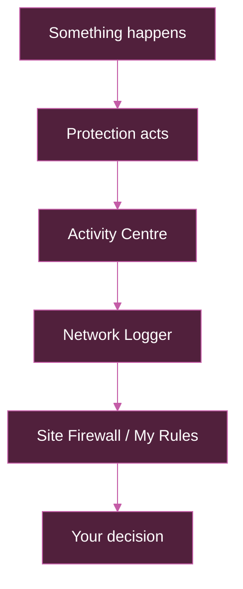
```mermaid
flowchart TB
    Event["Something happens"] --> Protection["Protection acts"]
    Protection --> Activity["Activity Centre"]
    Activity --> Logger["Network Logger"]
    Logger --> Firewall["Site Firewall / My Rules"]
    Firewall --> Decision["Your decision"]
    classDef warden fill:#51203c,stroke:#c45ca7,color:#ffffff
    class Event,Protection,Activity,Logger,Firewall,Decision warden
    linkStyle default stroke:#c45ca7
```

## Activity Centre

<sub><strong>INTERFACE · LOCAL SECURITY EVIDENCE</strong></sub>

**What it does:** keeps a record of what WardenOne did and why.

Your recent security events, on this device. What WardenOne blocked, warned about, learned or
allowed, with enough context to understand why. It's not an online dashboard. There's no account
and the history never gets uploaded.

Sensitive events are redacted. A warning about a token or a clipboard value or a ClickFix command
doesn't need to repeat the secret (or the harmful command) just to prove it saw one.

<p align="center">
  <a href="docs/screenshots/03-activity-centre.webp">
    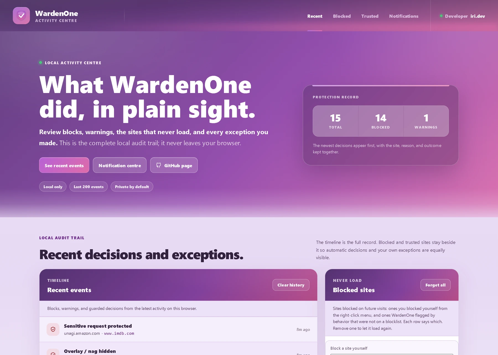
  </a>
</p>
<p align="center"><em>Stays on this device. Keeps the reason, not the secret.</em></p>

<details>
<summary><strong>Inspect the local timeline and exception controls</strong></summary>

<p align="center">
  <a href="docs/screenshots/03-activity-timeline.webp">
    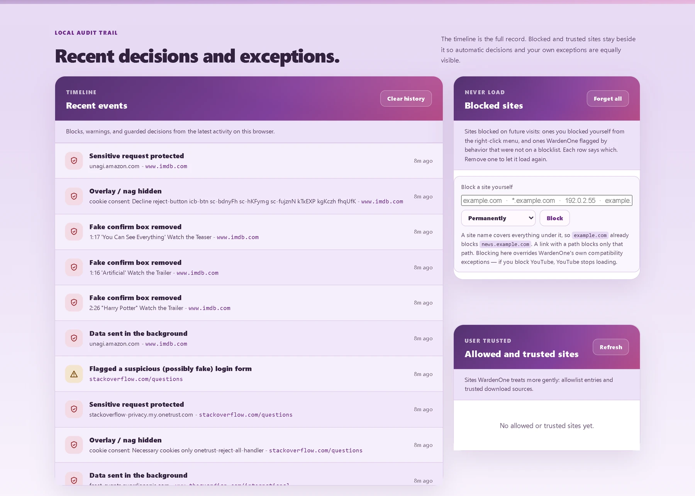
  </a>
</p>

</details>

## Notification Centre

<sub><strong>INTERFACE · NOTICE CONTROL</strong></sub>

**What it does:** lists every notice WardenOne can show, so you can silence the message without weakening the protection.

Each notice comes with what it means and how long it stays on screen, and you can choose not to see
it again. Muting a notice never turns off the protection behind it. That's why Silent mode is just
a display thing and doesn't make you any less protected.

<p align="center">
  <a href="docs/screenshots/12-notification-centre.webp">
    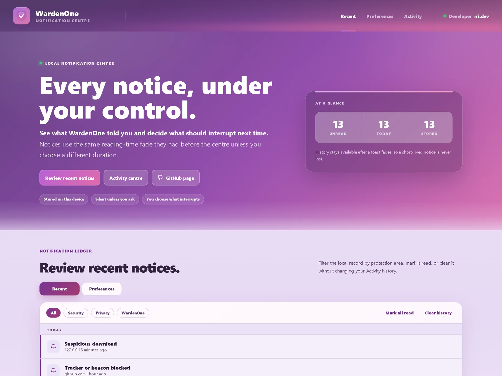
  </a>
</p>
<p align="center"><em>Notices stay here after the pop-up fades. Hiding them doesn't switch anything off.</em></p>

## Protection Health

<sub><strong>LOCAL CHECK · EXPECTED COMPONENTS & RULES</strong></sub>

**What it does:** checks that the protections you switched on are loaded and responding right now.

It checks the engines, registrations, lists and page components that should be there actually are
there, and that they respond. A saved setting isn't the same as a running protection. If
something's failed you see the failure, not a nice green state with the problem hiding underneath.

The Blocklist section shows two dates for each feed. When WardenOne last downloaded it, and the
date the publisher put in it. Open **Publisher dates** to see them one by one. A publisher date
over 30 days old gets flagged even if the download worked, and a feed without a reliable date says
**publisher date unknown**. Lists you subscribed to yourself show the same thing in **My filters**.
These dates are only about list health. They don't turn any rules off.

To check every source's live header yourself run `node tools/check-feed-publishers.js`. An old date
means a source is worth a look, not that it gets deleted. WardenOne keeps the last rules it
accepted and keeps checking daily while auto-update's on. Before I drop a source that really has
been abandoned I compare its unique domains and false-positive risk with the current feeds, and add
a vetted replacement if one's needed. The [September 2026 source review](docs/feed-freshness-review.md)
covers the four feeds with older dates (without removing them).

<p align="center">
  <a href="docs/screenshots/02-protection-health.webp">
    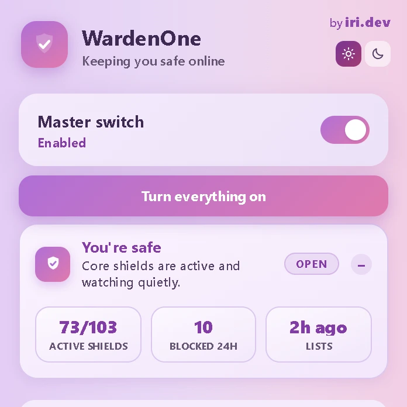
  </a>
</p>
<p align="center"><em>Switched-on shields, recent blocks and list freshness. The 105 switches are kept separate from the 108 protections overall.</em></p>

## Privacy Self-Test

<sub><strong>VERIFICATION TOOL · MEASURED PAGE RESULTS</strong></sub>

**What it does:** measures what a real page can still learn about you, by comparing protected and unprotected readings of the same document.

It tests the page in your active tab, not some page of its own. Each check runs twice in the same
page. Once through WardenOne's protected browser APIs and once through clean untouched copies of
them. **Protected** means the page really did get a different value. Not just that a switch was
on.

It measures canvas drawing and readback, audio, WebGL/WebGPU identity, machine hints, displays,
Client Hints, voices, keyboard layout, media capabilities, local WebRTC addresses, battery and
connection data, font access, game controllers, hyperlink auditing and tracking values in links or
the address bar.

The possible results are ✅ Protected · 🟢 Minimal exposure · 🟡 Partly protected · ℹ️ Allowed by
design · 🔴 Exposed. A shield you turned off yourself counts as your choice, not a failure. And the
score only includes checks that have a meaningful right answer.

<details>
<summary><strong>What the Self-Test can't measure, and won't pretend to</strong></summary>

Some things can only be checked with a server at the other end. Like whether a third party really
got your referrer, or whether a tracker request reached its server. WardenOne doesn't have one. And
contacting a tracker to find out if contacting trackers is blocked would be doing the exact thing
it's testing. So those say **not testable here** instead of getting a made-up green tick.

Nothing leaves your device. The WebRTC check doesn't use a STUN service, anything it adds to the
page gets removed after, and the address bar gets put back even if a check fails.

</details>

<p align="center">
  <a href="docs/screenshots/07-privacy-self-test.webp">
    
  </a>
</p>
<p align="center"><em>Results come from what the page actually received. Click the image for the full list of measurements.</em></p>

## Verify and Repair

<sub><strong>RECOVERY TOOL · LIVE PAGE COMPONENTS</strong></sub>

**What it does:** finds the tabs where WardenOne's page engine is not answering and restarts it.

If a switch says on but the Self-Test gets the unprotected value, Verify & Repair checks from the
inside. It asks WardenOne's isolated half in each open tab if the page engine still answers a
signed challenge, and reloads the tabs where it doesn't. Reloading instead of re-injecting is on
purpose. The engine only trusts a key it's handed once, before the page starts running, and
there's no private way to hand a key to a page that's already running. Tabs that answer are left
exactly as they are. So are sleeping tabs, paused sites and pages the engine doesn't run on.

After that you can run the Self-Test again from the outside. The two tools answer different
questions which is why one can't just print the other's result.

```text
Protection enabled
        ↓
Protection Health
        ↓
Privacy Self-Test
        ↓
Verify & Repair
        ↓
Test again
```

## Per-site control

**105 of the 108 protections have their own toggle**. The other three are watch-only. They record
events but never block or change a page, so there's nothing for a switch to decide.

When one protection gets one site wrong the **This site** panel lets you back off one step at a
time:

1. Pause WardenOne here for 15 minutes, an hour or eight hours.
2. Turn off one protection on this site only. The list shows the protections that run in the page.
   If one says *page part only* it also has a network part (blocking rules, headers, download
   checks) that keeps working on that site. Protections with no page part just aren't listed.
3. Allowlist the site for good, if that's really what you want.

A site override can only turn a protection off. It can't sneakily turn something on everywhere. And
pausing doesn't force a reload so you won't lose a half-filled form.

The next four tools work together. The Network Logger shows you what happened. The Site Firewall
lets you decide per site. My Rules is your own exact rules. Custom Lists are rules someone else
keeps up to date.

## Network Logger

<sub><strong>INVESTIGATION TOOL · REQUEST, OUTCOME & MATCHING RULE</strong></sub>

**What it does:** names the exact request behind an event, whether it was blocked or allowed, and which rule decided.

The Activity Centre tells you something happened. The Network Logger tells you which request it
was. If a site breaks start here, not by switching protections off at random.

Each row shows the request type, the page, whether it's first or third party, what happened to it
and what matched it. You can turn a row into a rule that blocks the exact host, the whole domain or
the path, or allows it back. All of those go into My Rules so your decisions are all in one place.

It only records while a logger page is open. Up to 1,000 requests are kept in memory and thrown
away when the last logger closes. Sign-in details, query values, the fragment and any part of a path that is not plain route vocabulary are removed
before a request gets recorded. What's left is the scheme, host, route and parameter names, plus a
value only if it's a flag, a small number or a plain word. Nothing gets saved to disk unless you
press Export. (And remember an export is still a list of the sites you visited.)

<p align="center">
  <a href="docs/screenshots/09-network-logger.webp">
    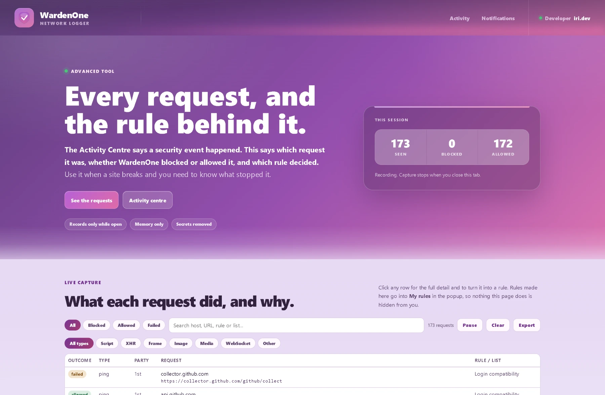
  </a>
</p>
<p align="center"><em>While the logger's open every request shows what happened to it and which rule decided.</em></p>

<details>
<summary><strong>Inspect the request ledger</strong></summary>

<p align="center">
  <a href="docs/screenshots/09-network-logger-requests.webp">
    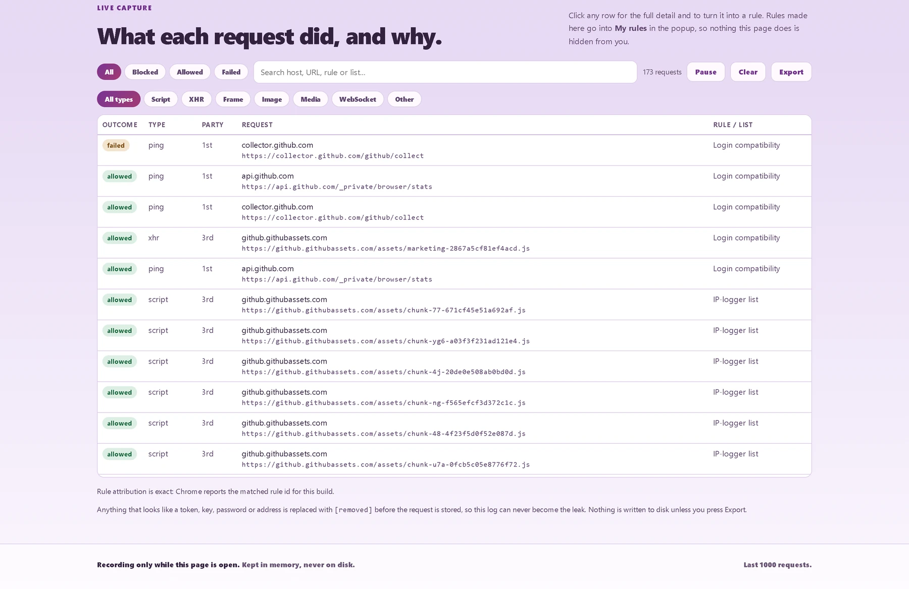
  </a>
</p>

</details>

## Site Firewall

<sub><strong>CONTROL SURFACE · PER-SITE NETWORK POLICY</strong></sub>

**What it does:** lets you decide what each domain a page loads is allowed to do, on that site alone.

Shows every domain the current page loads and lets you decide if each one can run scripts, make
requests, load frames or media, or carry cookies. **On this site only.** Your choice there beats
the lists WardenOne ships with.

It's powerful enough to break a page completely so it doesn't pretend to be a friendly on/off
switch. Undo is always one click (for this site or everywhere) and the grid shows exactly what a
rule will cover before it gets saved.

<p align="center">
  <a href="docs/screenshots/08-site-firewall-with-rule.webp">
    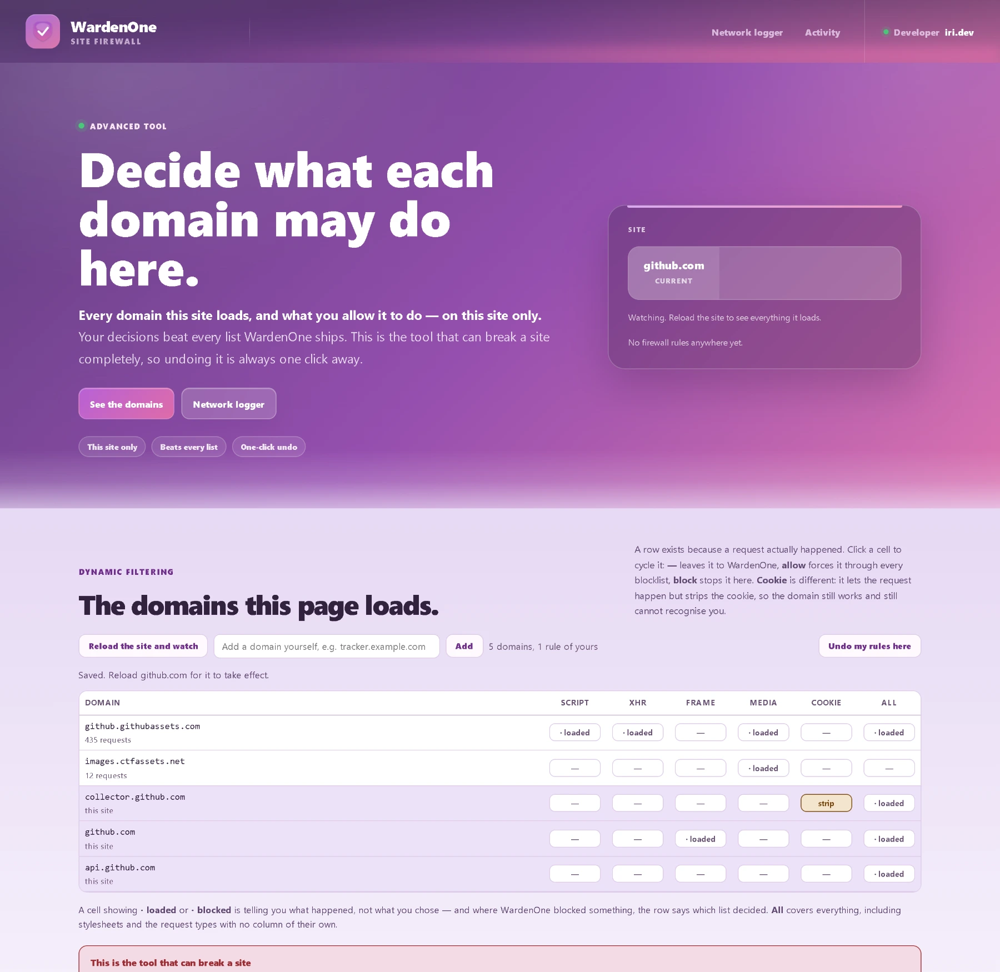
  </a>
</p>
<p align="center"><em>Domains, request types, what happened and how far your own rule reaches. All at once.</em></p>

## My Rules

<sub><strong>CONTROL SURFACE · PRECISE PERSONAL POLICY</strong></sub>

**What it does:** lets you write your own filter rules, and your rules beat every list WardenOne ships.

It's the usual Adblock syntax:

```text
||ads.example.com^       block a host
@@||example.com^         allow a site back
example.com##.promo      hide an element on one site
##.promo                 hide an element everywhere
```

Import and export are plain text. If WardenOne can't apply a rule it tells you the line number and
why, instead of quietly saving it. A saved rule that does nothing is worse than one that gets
refused. It lets you think you're covered when you're not.

## Custom Lists

Subscribe to a country-specific annoyance list, a niche tracker list or one you maintain yourself.
Each one gets its own switch, last-updated status, rule count and refresh button.

Lists have to come over HTTPS. Private addresses, weird ports and redirects to them get refused.
If a refresh fails the last working copy stays. The list's host only finds out its public list was
downloaded. It doesn't get your browsing history or which rules matched.

## Script Shield

Can block JavaScript and WebAssembly everywhere, block scripts on one site, only allow trusted
third-party script hosts, or filter known fingerprinting scripts. Lockdown and Smart are separate
modes because "this page won't run any scripts" and "untrusted third-party scripts get limited"
are really different promises.

<p align="center">
  
</p>

# Content blocking

Ad blocking is still a big part of WardenOne. I just didn't want it to be the first thing you read
about.

## AdShield

Network filtering, cosmetic rules and anti-adblock scriptlets, in the same formats you'd know from
EasyList, AdGuard and uBlock. Shipped rules, your own element removals and rules from custom lists
are kept apart. So allowing one thing back doesn't undo something unrelated.

## YouTube AdShield

YouTube ads get removed by taking the ad schedule out of the player's data. Not by covering the ad
with a black box or racing to hit skip. Pre-rolls, mid-rolls, the ad UI around the player and
player changes are all handled together. Account refreshes, captions, playback controls and the
seek bar keep working like normal.

YouTube changes all the time. There are compatibility checks and a YouTube-only pause because if a
video won't play the protection has failed. Doesn't matter how many ads it blocked.

## Twitch AdShield

Twitch stitches ads straight into live streams, so normal request blocking can freeze the player or
leave it looping. Instead WardenOne asks Twitch for another clean stream session (signed by Twitch
itself) and keeps the video sequence continuous while it switches over. Display and
picture-in-picture ads get declined before they load.

No third-party proxy ever touches the video. If Twitch doesn't offer a usable clean session the ad
just plays, instead of the player freezing or looping behind a cover. That's on purpose. A stream
you can watch matters more than a blocked ad you can't get past.

## Spotify AdShield

Spotify's web player gets its playback state from Spotify's servers. WardenOne doesn't touch that
state, the responses carrying it or anything on your account. It works in three layers, all on
your side.

**First, the track loader.** Every track the player loads passes through one callback with the
media URL it's about to load. If Spotify itself labels that track as an ad the URL gets swapped for
a one-second silent clip. Nothing from the ad gets downloaded, the clip ends by itself, and the
player moves on to the next song like it would after a real ad. It's the same trick AdGuard's
filter uses on open.spotify.com and it doesn't care which host the ad would've come from.
WardenOne's version also covers ads delivered through Spotify's manifests.

**Second, the network.** Requests to the Spotify ad-media hosts on uBlock Origin's list get
redirected to the same silent clip. Media requests only, so songs (which load over fetch) never get
touched. Media the web player loads is also let through the ad and tracker lists, because some
podcasts deliver their audio through an analytics prefix and those need to play. Not stall.

**Third, a fallback** for an ad that still makes it to the player unchanged. It's recognised from
Spotify's own metadata and muted before it plays, then skipped to near the end. But only once
Spotify confirms that ad is the one playing right now. Each confirmed ad gets skipped at most once
so preloads and retries can't set off a chain of skips. Without that confirmation the ad stays
muted and plays through. The silent clip itself never gets skipped and the ad UI is hidden while
the ad slot lasts. If Spotify changes how it delivers ads none of this promises an instant
transition.

There's a separate problem too. Sometimes Spotify answers an audio-license request with HTTP 429
and the player skips through a bunch of songs on its own. WardenOne holds that rejected response
for up to ten seconds, which gives a good license that's already on its way a chance to keep
things steady. It never makes an extra license request, your own skips aren't slowed down and good
licenses pass straight through. In a live retest one song kept playing through a 429. But a later
burst of rejections still made Spotify jump to a different song. So it only partly helps. It can't
override a license Spotify refuses to give.

Normal songs, previews and podcast episodes never get muted or skipped. Turning AdShield off (or
allowlisting open.spotify.com) switches all of this off. It's a workaround for the web player, not
a replacement for Premium. Spotify can change its player whenever and you might still notice a
short transition.

## Search cleanup

Sponsored results on Google and Brave (and their ad-click wrappers) can be removed. Hiding Google's
and Brave's AI answer panels is optional. For Google WardenOne uses Google's own plain Web mode,
which asks for the classic ten blue links in the first place, so there's no panel that flashes up
and then gets hidden.

Answer-scraper sites get dimmed and labelled with a **Show anyway** button. Never quietly deleted.
If a search filter hid the one useful result you'd never know it happened, and that's worse than a
mistake you can see.

## Element Zapper

Point at a sticky bar, a leftover consent box, a sidebar, a floating video, whatever, and remove
it. It's remembered for that site and saved locally the same way as your own cosmetic rules.
`Ctrl+Z` can undo a few removals even after the tool closes. And if you select something big it
asks first (mouse or keyboard).

<p align="center">
  <a href="docs/screenshots/13-element-zapper.webp">
    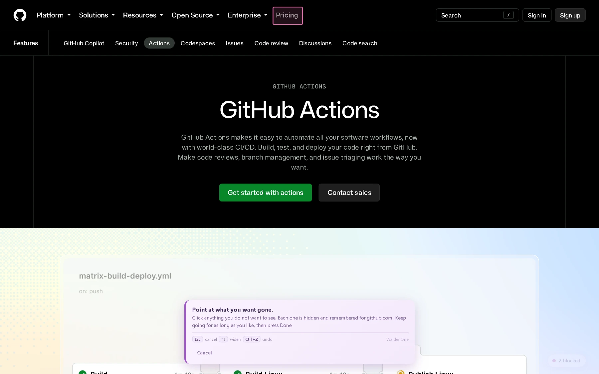
  </a>
</p>
<p align="center"><em>Point, click, gone. It's remembered for that site, and <code>Ctrl+Z</code> still works after the tool closes.</em></p>

## Cryptojacking protection

Known mining-as-a-service scripts, third-party mining-pool traffic and stratum WebSockets get
blocked. A mining pool's own website still works if you go there on purpose. Optional deep
detection looks through the code of background workers for mining routines and stops the worker
(plus any replacements the miner starts) without killing the rest of the page.

High CPU on its own never counts as mining. A video export, a WebAssembly build and a miner can all
max out your cores. WardenOne goes by mining code it can actually see, which means a well-hidden
miner can slip past.

<p align="center">
  
</p>

# Tools, performance and comfort

## Right-click tools

Everything's under one **WardenOne** entry in the right-click menu, split into groups. Element
Zapper and Copy clean link act on whatever you right-clicked. Check this link, Check selected text,
Where is this image from? and What is this frame? answer a question about it without you having to
go there. Sleep this tab, Never sleep this site and Close this tab act on the tab. Block this site
blocks the site everywhere.

Copy clean link is there as well as the automatic link cleaning because Chrome's own **Copy link
address** and the address bar are part of the browser itself. Page scripts can't step in there.

Sleep this tab unloads the tab to free up memory and moves you to the next tab, so you're not left
staring at a blank page. The tab stays in the strip and reloads when you click it. Both sleeping and
closing stop if you've typed something you haven't saved or the camera or mic is in use, and tell
you which one. Closing has that check because closing a tab this way skips the browser's own "leave
site?" prompt. `Ctrl+W` still closes a tab no matter what.

Never sleep this site works per host, not per domain. So marking your mail keeps your mail awake
without affecting the rest of that domain. Same menu entry takes the mark off again.

## Command Palette

If your browser's assigned the suggested **Alt+Shift+O** shortcut, press it, type a few letters and
pick something. Check the site, run the Self-Test, hide an element, clean the page address, pause
here, open the Logger or Firewall, check a file or extension, look at Activity, open settings.

<p align="center">
  <a href="docs/screenshots/13-command-palette.webp">
    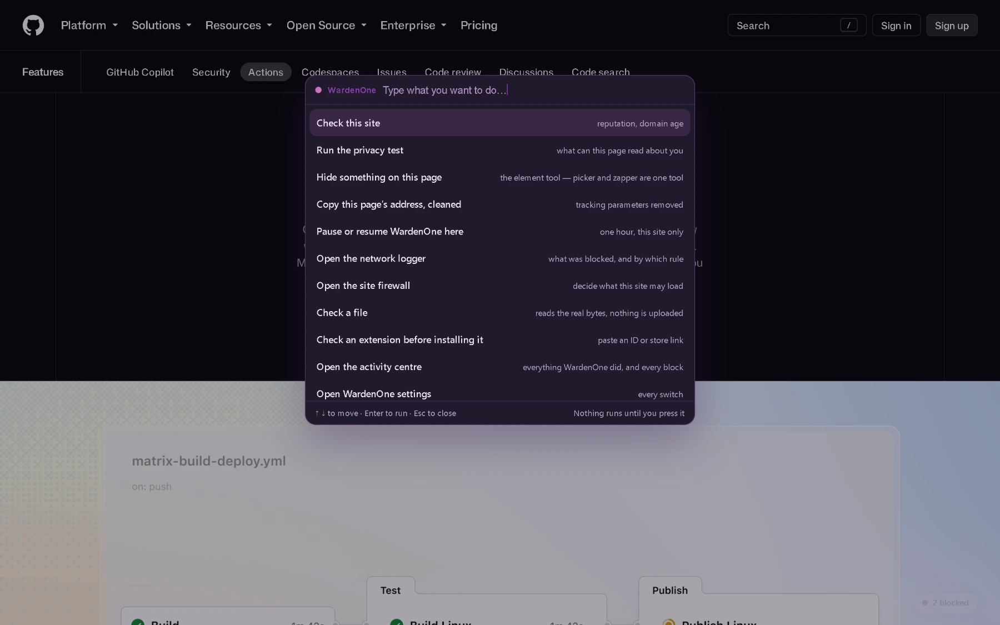
  </a>
</p>
<p align="center"><em>Every WardenOne tool, one shortcut away. Nothing runs until you press Enter.</em></p>

<details>
<summary><strong>Why the page can't use the palette for its own ends</strong></summary>

The palette on the page only displays things. The background worker owns the list of commands. It
rejects any ID it doesn't know and only accepts a choice that carries the one-use grant the
shortcut gave that exact tab's palette. That grant is a random value kept in WardenOne's own
isolated world, which the page can't read. Its hash lives in `storage.session` so it survives the
background worker going to sleep (Chrome does that within the two minutes a palette stays valid)
but disappears when the browser closes. It gets used up the moment it's spent. One press of the
shortcut, one action. A fake message from the page can't make a grant.

The palette only gets added to the page when you open it, inside a closed shadow root. The page
can't read what you type into it or restyle it into something misleading.

</details>

## Keyboard Shortcuts

Shortcuts use Chrome's own extension shortcut system, not a key listener injected into every page.
So pages can't see them or swallow them. You can change them at `chrome://extensions/shortcuts`
(`brave://extensions/shortcuts` in Brave).

WardenOne suggests four keys, including **Alt+Shift+U** for cleaning up the page address. The other
commands don't have a suggested key on purpose. Your browser might leave a suggested key unassigned
if it clashes with something or you cleared it. If the palette key says **Not set** use the **Open
palette** or **Set shortcut** button in the popup. WardenOne can't assign a browser shortcut for
you.

## Forget Me & Logins

Clears a site's cookies and storage after you close its last tab (except allowlisted sites).
There's a one-click button to clear them right now too.

## Privacy Cleaner

Pick exactly what to clear and over what time range. Cache, consent and tracking cookies, all
sign-ins, history, download history, local storage, service workers, saved form data, or camera,
mic and location permissions.

## Settings Backup

Exports all your settings to a file you keep. API keys are never included and an imported file
can't sneak one in. There's no account and no cloud sync, so this is how you move your setup
somewhere else.

## Memory Shield

Puts inactive tabs to sleep, with Gentle, Balanced, Aggressive or Emergency profiles. You can stop
pinned tabs, tabs playing audio and tabs with forms, logins or payments from ever sleeping. It can
find duplicate and zombie tabs too, and free up memory whenever you ask.

From the right-click menu you can also put a tab to sleep straight away, or mark a site
never-sleep. That mark is your call, not a judgement about the site, so it beats every rule above.
A tab on a marked host never gets slept. Whatever the profile would've done.

<details>
<summary><strong>See Memory Shield's safeguards and profiles</strong></summary>

<p align="center">
  <a href="docs/screenshots/12-memory-shield.webp">
    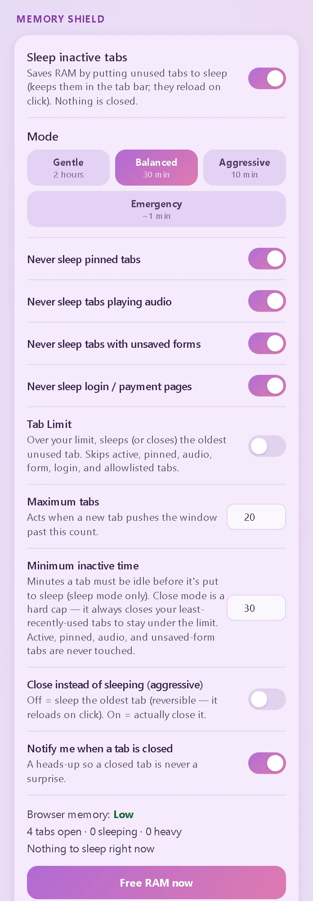
  </a>
</p>

</details>

## Resource Saver

Controls for autoplaying media, background throttling, lazy-loading images, prefetch and preload.
These are about performance and they're kept separate from the security side.

## EyeShield

Remembers a display mode for each site (Normal, Light, Dark, or Ultra which is OLED black) along
with brightness, contrast, saturation, warmth and greyscale. The extra sliders live under **More
reading controls** in the popup and they announce their values as percentages. Security warnings
keep their keyboard and screen-reader support whether EyeShield's on or not. The local
accessibility check (and the spoken screen-reader pass that's still to come) is written up in
[the accessibility audit](docs/accessibility-audit.md).

## WardenOne Themes

WardenOne's own pages come in light and dark and both keep warnings, status colours and disabled
buttons easy to tell apart. Light is the default. Pick Dark in the popup (or its Interface section,
or onboarding) to switch every page, or System to follow your operating system. Even if it changes
while you're browsing.

## Twitch Local Rewind

Lets you scrub back through a live stream or jump back to when you joined. VOD Rewind does the
same for recorded streams. These are just comfort features and they're separate from the ad and
security engines.

## Adult-site Arrival Screen

An optional screen that shows up before a listed (or likely) adult site loads. So a typo or a
redirect you didn't click doesn't put explicit content right in front of you.

## SafeSearch & Restricted Mode

Can enforce SafeSearch on Google, Bing, DuckDuckGo, Brave Search and Yahoo, plus YouTube's
Restricted Mode. It's separate and off by default because it changes what search and video sites
show you.

<p align="center">
  
</p>

# Privacy, permissions & transparency

WardenOne asks for a lot of browser access because it protects a lot of the browser. Requests,
pages, downloads, cookies, sessions, site permissions, your installed extensions. That's a lot to
ask for so I've tried to explain every bit of it properly.

<p align="center">
  <a href="docs/screenshots/10-permissions-explained.webp">
    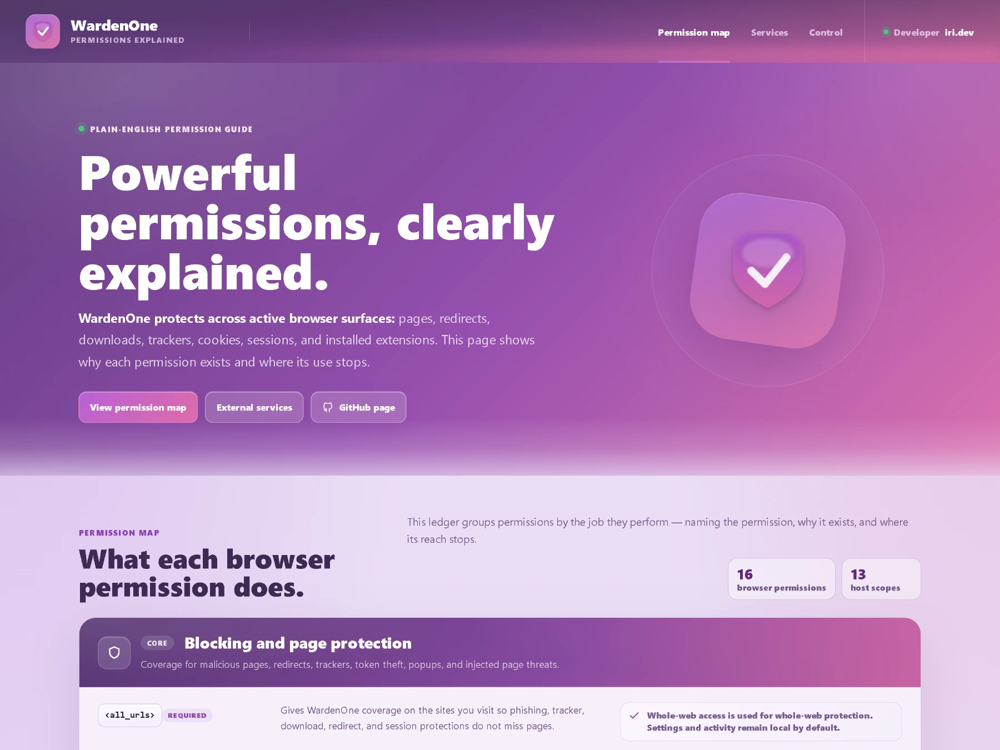
  </a>
</p>
<p align="center"><em>Each permission, what it's for, and where its reach stops.</em></p>

The [permissions guide](permissions.html) that comes with WardenOne goes through every permission
and what it's for. [PRIVACY.md](PRIVACY.md) covers what's stored, what network traffic there is and
every optional service, in full.

In short:

- **No account and no telemetry.** Your browsing doesn't go through any server of mine and there's no analytics.
- **Open source.** The code, the pages, the tests and the bundled rule data are all here in this repo.
- **Local.** Your activity, settings, learned tracker evidence, file analysis and extension-ID matching all stay on your device.
- **Secrets stay secret.** No login token or password ever gets stored, and none gets sent anywhere except the site it came from. The only place a token moves at all is Twitch ad blocking. It sends the Twitch page's own `Authorization` header back to `gql.twitch.tv` so the playback request gets accepted. It's read from the page, never written down, and never leaves Twitch.
- **Outside checks only happen when you ask.** A domain, URL, extension ID, hash or k-anonymous prefix only leaves your device for an optional check you turned on or asked for. The one exception is the network filtering self-test, which loads a favicon from some named adult and malware-test domains to see what your network blocks. That's the whole point of it. It says so on the page and only your click starts it.
- **Files never get uploaded.** File Shield's VirusTotal button sends only the SHA-256, only when you press it, and only with your own key.
- **Updates aren't telemetry.** Rule updates just download public list files and say nothing about your browsing. If one fails the old copy stays.

<details>
<summary><strong>See how optional provider keys are explained</strong></summary>

<p align="center">
  <a href="docs/screenshots/10-optional-provider-keys.webp">
    
  </a>
</p>

Every provider is optional. WardenOne's local lists, heuristics and page protections all work
without a key. Adding one gives you one specific kind of lookup. It doesn't switch on some
hidden backend.

</details>

# How WardenOne works

There's no WardenOne server in the middle of your browsing. The work's split across the parts of
the browser that actually have the evidence:

- **Browser network layer.** Rules for listed destinations and direct private-network targets, plus redirect and download checks.
- **Page and session layer.** Fake interfaces, logins and passwords, privacy APIs, links, and signs of device use.
- **Extension worker.** Local state, and the browser APIs that join the layers together.
- **Local pages.** Activity, Self-Test, Repair, Logger, Firewall and the review tools, where you see and control what happened.

Browser-enforced network rules keep working even if a website changes its JavaScript. The token
and skimmer checks are different. They wrap page APIs like `fetch`, XHR and `sendBeacon`, and a
hostile page can replace those wrappers, borrow an unwrapped copy or send data some other way they
don't watch. They stop the matching calls they see. But they can't guarantee that malicious code
already running in a page won't get a secret out. The network rules block the destinations they
cover. They don't look inside a random request for your secret.

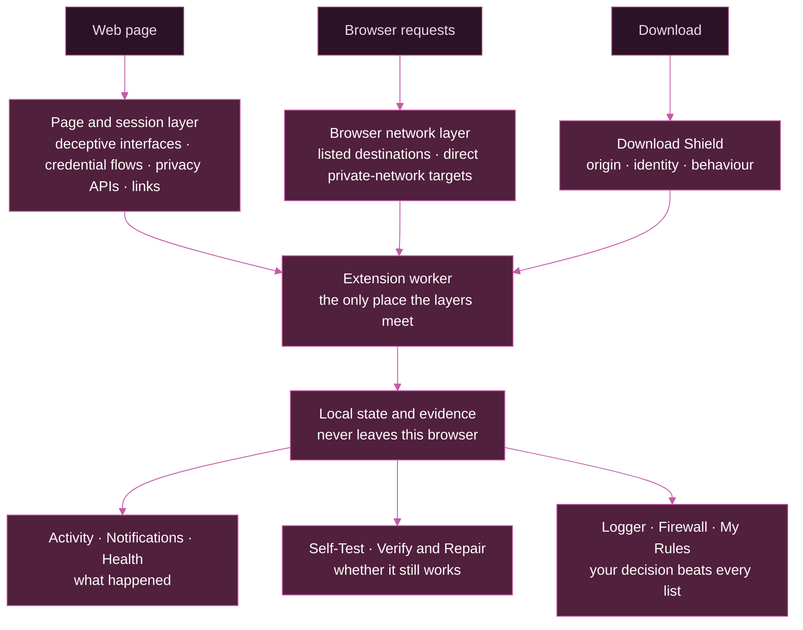
```mermaid
flowchart TB
    Page["Web page"] --> PageLayer["Page and session layer<br/>deceptive interfaces · credential flows · privacy APIs · links"]
    Net["Browser requests"] --> NetLayer["Browser network layer<br/>listed destinations · direct private-network targets"]
    Dl["Download"] --> DlLayer["Download Shield<br/>origin · identity · behaviour"]

    PageLayer --> Worker
    NetLayer --> Worker
    DlLayer --> Worker

    Worker["Extension worker<br/>the only place the layers meet"] --> State["Local state and evidence<br/>never leaves this browser"]

    State --> Explain["Activity · Notifications · Health<br/>what happened"]
    State --> Prove["Self-Test · Verify and Repair<br/>whether it still works"]
    State --> Control["Logger · Firewall · My Rules<br/>your decision beats every list"]

    classDef warden fill:#51203c,stroke:#c45ca7,color:#ffffff
    classDef entry fill:#2b1226,stroke:#8d3f74,color:#f0d7e8
    class PageLayer,NetLayer,DlLayer,Worker,State,Explain,Prove,Control warden
    class Page,Net,Dl entry
    linkStyle default stroke:#c45ca7
```

Everything ends up in one worker and one local store, and the pages you use to see, check and
control it all read from there. That's what the **One** in WardenOne really means. One place where
everything each layer notices ends up. Not a pile of separate tools sharing an icon.

Some tools sound like they overlap but they look at different evidence. Download Shield knows the
browser's context, File Shield knows the bytes. Activity records the event, the Logger names the
request and the rule. The Self-Test measures from outside, Verify & Repair checks from inside. An
extension's identity history and its current permissions answer different questions too. I kept
them apart on purpose so nothing gets squashed into one convenient score that promises more than
it can back up.

# How I build WardenOne

My local copy is usually a good way ahead of what's pushed here.

I build in VS Code with the extension loaded, and I'll happily sit with one thing for
hours — edit, reload, hard-refresh, watch what the page actually does, go again. Almost
none of that is worth a commit on its own, so I push once something is finished and I'm
actually sure about it. The history goes quiet and then several commits land at once,
which is usually just one long session finally ending. Probably more of those at 2am
than is strictly sensible.

Use Node 24 (recorded in `.node-version`). Everything goes through
`node tools/check-maintainability.js` first. And when something
turns out to be wrong on a real site, I'd rather leave the revert sitting in the history
than tidy it away.

## A source bundle for review

Run `node tools/build-source-bundle.js` from a clean checkout to make a ZIP next to the repo. It has
every file tracked in the current commit (`src/`, `tools/`, the docs, everything) and leaves out
local folders like `.git/`, `.store-candidates/` and `.publish/`. That's the source for review. The
Latest release ZIP is the smaller extension package. It won't run on a checkout with uncommitted
changes, so nothing gets silently left out. Use `--committed` only if you really do want a ZIP of
`HEAD` without your uncommitted changes.

## The performance profile

Guessing what something costs isn't the same as measuring it, so release candidates get profiled
too. `node tools/perf-profile.js` loads the real extension into a real browser and measures three
local test pages. An article, a page that builds a deep DOM like frameworks do, and a page with
eight frames. Extension off and on, five runs each. It writes the medians, the tails and every raw
value to [docs/perf](docs/perf/), tied to the commit and the browser version.

It won't measure anything unless the extension's actually loaded and running. It has to prove it
can spot a known regression before its numbers count. And nothing it does leaves the machine. The
current build's profile (and how to read one) is in [docs/perf/README.md](docs/perf/README.md).

## The Store package

The GitHub build is all of WardenOne. The Chrome Web Store package I've got ready includes
EyeShield's optional readability controls and Memory Shield's resource controls, Tab Limit
included. It leaves out Twitch Rewind, which is really its own separate media tool. And that means
its files, manifest entries and settings, not just a line in the description.
`node tools/build-store-package.js` builds that package from a commit, byte-for-byte reproducibly.
The worker and popup read `build-profile.js` so they run fine without the parts that got left out.
Why, and where every popup section fits under the one purpose, is in
[docs/store-single-purpose.md](docs/store-single-purpose.md). Nothing's been submitted yet. The
tool's there so if it ever is, what goes up matches the record exactly.

# Official source & authenticity

**Website:** [iri-dev.github.io/WardenOne](https://iri-dev.github.io/WardenOne/)

**Author:** [iri](https://github.com/iri-dev) (`iri-dev` on GitHub) · [iri-dev.github.io](https://iri-dev.github.io/)

Releases only ever come from [github.com/iri-dev/WardenOne](https://github.com/iri-dev/WardenOne).
WardenOne is never an executable installer. In August 2026 someone republished the project under
another account and pointed its downloads at a credential stealer. GitHub took the account and site
down. The [incident page](https://iri-dev.github.io/WardenOne/stolen) has the file details,
antivirus results and recovery steps if you ran the fake copy.

A security extension has a lot of access to your browser so where you got it from really matters.
A build from another repo, file host or website didn't come from me. Even if the screenshots and
description got copied word for word. If you want extra reassurance there's an
[optional download check](#verify-the-github-download) below.

## Verify the GitHub download

**Optional, for advanced users.** The three [Quick install](#quick-install) steps are all you need
to install the ZIP from the official GitHub release. You only need `WardenOne-latest.zip`; downloading
the `.sha256` file, calculating a hash and using the GitHub CLI are optional. These checks just give
you extra evidence about the exact ZIP you downloaded:

- **SHA-256 checksum.** If the ZIP was damaged, changed or mixed up with another one, its hash
  won't match the one published with the same release.
- **GitHub build attestation.** A record that ties those exact ZIP bytes to a build run by this
  repository's GitHub Actions workflow from `main`.

To check the hash, download [WardenOne-latest.zip.sha256](https://github.com/iri-dev/WardenOne/releases/latest/download/WardenOne-latest.zip.sha256) from the same release page as the ZIP. The Latest link moves to a new, verified commit build only after both files have been uploaded and checked; the previous rolling release is then removed. If the hashes don't match, open the current release page and download both files again together. Don't load a ZIP that still fails. The release notes show the ZIP's SHA-256 and link to its attestation too.

On Windows PowerShell, in the directory containing both files:

```powershell
$expected = ((Get-Content .\WardenOne-latest.zip.sha256 -Raw) -split '\s+')[0]
$actual = (Get-FileHash .\WardenOne-latest.zip -Algorithm SHA256).Hash
if ($actual -ine $expected) { throw 'WardenOne ZIP checksum mismatch' }
'SHA-256 matches'
```

On Linux, run `sha256sum -c WardenOne-latest.zip.sha256`; on macOS, run `shasum -a 256 -c WardenOne-latest.zip.sha256`.

For the optional build-origin check, use the [GitHub CLI](https://cli.github.com/):

```text
gh attestation verify WardenOne-latest.zip --repo iri-dev/WardenOne --signer-workflow iri-dev/WardenOne/.github/workflows/gate.yml --source-ref refs/heads/main
```

Neither check proves every protection is bug-free. Also compare the attested source commit with the
full commit in the release notes, because an older ZIP can have a valid attestation too.

# Feedback & security reporting

Found a site WardenOne breaks, a false positive, or got an idea? Use the
[issue forms](https://github.com/iri-dev/WardenOne/issues/new/choose). For a broken site the URL
and which protection was involved help me the most.

Found a vulnerability in WardenOne itself? **Please don't put exploit details, secrets or live
harmful payloads in a public issue.** Read [SECURITY.md](SECURITY.md) and use GitHub's
[private vulnerability report](https://github.com/iri-dev/WardenOne/security/advisories/new)
instead. I'd much rather hear about it than not 💜

# Licence & credits

Copyright (C) 2026 iri. WardenOne is licensed under the **GNU General Public License v3 or later**;
see [LICENSE](LICENSE), [NOTICE](NOTICE) and [CREDITS.md](CREDITS.md). You're welcome to share
modified versions under the licence, as long as the changes are marked and the notices are kept.

WardenOne wouldn't exist without the open-source blocking community. AdGuard, EasyList,
EasyPrivacy, TwitchAdSolutions, scamorza/TwitchAdBlock, GosuDRM/TTV-AB, uBlock Origin uAssets and
more. The full list of sources and credits is in [CREDITS.md](CREDITS.md).
